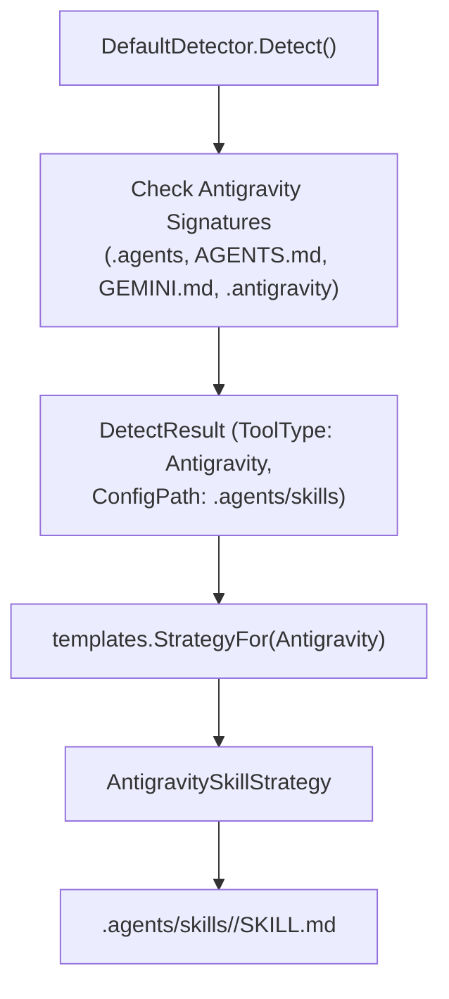

# SPDD Analysis: Antigravity AI Tool Skills & Path Support for OpenSPDD

## Original Business Requirement

Support Antigravity as a first-class AI tool target whose SPDD command set is generated as project-scoped skill bundles under `.agents/skills/<id>/SKILL.md` (the standard Antigravity scans natively), updating the environment detector signatures (`.agents/`, `AGENTS.md`, `GEMINI.md`, `.antigravity/`) and config directory path to align with the official Google Antigravity Customization Specification.

---

## Domain Concept Identification

### Existing Concepts (from codebase)

- **`AIToolType` Taxonomy**: `Antigravity` is already defined as an enum value (`"antigravity"`) in `internal/detector/types.go`.
- **Legacy Fallback Path**: Currently `Antigravity.GetConfigDir()` returns `".antigravity/commands"` and uses `FlatMarkdownStrategy` (generating `.antigravity/commands/<id>.md`). This path is not discovered by Google Antigravity CLI (`agy`) or Antigravity IDE.
- **`GenerationStrategy` Pattern**: Introduced in `GGQPA-005` via `templates.GenerationStrategy` and the self-registering `strategyRegistry`. `CodexSkillStrategy` already proved the directory-bundle generation model for `.agents/skills/<id>/SKILL.md`.
- **First-Match Deterministic Detection**: `DefaultDetector.Detect()` checks `toolTypes` in order (`Cursor`, `ClaudeCode`, `Antigravity`, `GitHubCopilot`, `OpenCode`, `Codex`).

### New & Refined Concepts

- **Antigravity Customization System Specification**: Google Antigravity CLI (`agy`) and Antigravity IDE discover skills in `.agents/skills/<id>/SKILL.md` (project-scoped) and `~/.gemini/skills/<id>/SKILL.md` (global).
- **Workspace Signatures**: Antigravity workspaces are marked by `.agents/` (or `.agent/`), `AGENTS.md`, or `GEMINI.md` (as well as legacy `.antigravity/`). Updating `Antigravity.GetSignatureFiles()` to include these signatures ensures reliable auto-detection.
- **Antigravity Skill Strategy**: Antigravity uses the directory-bundle format where each command is packaged as `<workingDir>/.agents/skills/<id>/SKILL.md` with YAML frontmatter containing `name` and `description`. Unlike Codex, Antigravity does not require an `agents/openai.yaml` sub-file.
- **Strategy Registration**: Registering `AntigravitySkillStrategy` in `internal/templates/antigravity_strategy.go` ensures both `openspdd generate --all` and `openspdd generate <name>` route through the skill bundle generator.

---

## Conceptual Relationships

1. `Antigravity.GetConfigDir()` returns `.agents/skills`.
2. `Antigravity.GetSignatureFiles()` checks `[".agents", "AGENTS.md", "GEMINI.md", ".antigravity"]`.
3. `StrategyFor(detector.Antigravity, mgr)` returns `*AntigravitySkillStrategy`.
4. Single-template generation (`openspdd generate spdd-analysis`) and batch generation (`openspdd generate --all`) both output `.agents/skills/<id>/SKILL.md`.

---

## Strategic Decisions & Trade-offs

1. **Standalone Strategy vs Shared Strategy**:
   - *Decision*: Create `antigravity_strategy.go` implementing `GenerationStrategy` and register it in its own `init()`.
   - *Rationale*: Preserves modularity, mirrors `codex_strategy.go` and `copilot_strategy.go`, avoids coupling Google Antigravity with OpenAI Codex logic, and omits the unnecessary `openai.yaml` generation.
2. **Backward Compatibility**:
   - Keep `.antigravity` in `GetSignatureFiles()` so legacy directories continue to be recognized.
   - Preserves `flat_strategy.go` unchanged for flat-file tools (Cursor, Claude Code, OpenCode).
3. **Detection Precedence**:
   - Keep `Antigravity` in its existing slot in `toolTypes` (`Cursor` -> `ClaudeCode` -> `Antigravity` -> `GitHubCopilot` -> `OpenCode` -> `Codex`).
