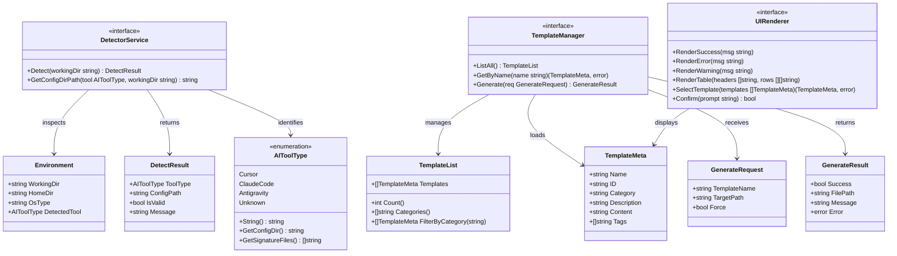

# CLI Tool Implementation: Environment Detection, File CRUD, Template Generation, and Subcommand Architecture

## Requirements
- Implement a zero-dependency Go CLI tool (`spdd`) for initializing and managing AI coding assistant command templates across Cursor, Claude Code, and Antigravity environments.
- Auto-detect the current AI coding environment by scanning for environment-specific signature files/directories.
- Provide interactive terminal UI for template selection and generation using modern TUI libraries.
- Distribute command templates via a single compiled binary with embedded resources, requiring no external runtime dependencies.
- Support three core subcommands: `init` (environment setup), `list` (show available templates), and `generate` (create template files).

---

## Entities



---

## Approach

1. **CLI Architecture (Cobra-based)**:
   - Use `github.com/spf13/cobra` for command routing with root, init, list, and generate subcommands
   - Implement modular structure separating CLI definitions (`cmd/`) from core business logic (`internal/`)
   - Root command performs environment detection as a global pre-run hook
   - Each subcommand has clear single responsibility

2. **Environment Detection Strategy**:
   - Scan current working directory and parent directories for signature files:
     - Cursor: `.cursor/` directory or `.cursorrules` file
     - Claude Code: `.claude/` directory or `CLAUDE.md` file
     - Antigravity: `.antigravity/` directory
   - Fall back to user home directory detection if project-level detection fails
   - Provide manual override via `--tool` flag for edge cases

3. **Template Management**:
   - Use Go 1.16+ `embed` directive to compile templates into binary
   - Store templates as Markdown files in `internal/templates/data/` directory
   - Parse template metadata from YAML frontmatter
   - Use `text/template` for dynamic variable substitution if needed

4. **Terminal UI/UX**:
   - Use `github.com/charmbracelet/huh` for interactive template selection forms
   - Use `github.com/fatih/color` for colored terminal output
   - Provide both interactive and non-interactive modes (support piping)

5. **Error Handling**:
   - Return idiomatic Go errors with context using `fmt.Errorf`
   - Define custom error types for specific failure scenarios (ErrFileExists, ErrToolNotDetected)
   - Handle errors gracefully at command layer with user-friendly messages

---

## Structure

### Inheritance Relationships
1. `DetectorService` interface defines environment detection contract
2. `DefaultDetector` implements `DetectorService` interface
3. `TemplateManager` interface defines template operations contract
4. `EmbeddedTemplateManager` implements `TemplateManager` interface
5. `UIRenderer` interface defines terminal output contract
6. `CharmUIRenderer` implements `UIRenderer` using Charm libraries

### Dependencies
1. `cmd/root.go` injects `DetectorService` and initializes global state
2. `cmd/init.go` depends on `DetectorService` and `UIRenderer`
3. `cmd/list.go` depends on `TemplateManager` and `UIRenderer`
4. `cmd/generate.go` depends on `TemplateManager`, `DetectorService`, and `UIRenderer`
5. `internal/detector` depends only on standard library (`os`, `path/filepath`)
6. `internal/templates` depends on `embed` and `text/template`
7. `internal/ui` depends on `github.com/charmbracelet/huh` and `github.com/fatih/color`

### Layered Architecture
1. **Entry Layer** (`main.go`): Program entry, calls `cmd.Execute()`
2. **Command Layer** (`cmd/`): Cobra command definitions, argument parsing, orchestration
3. **Service Layer** (`internal/detector`, `internal/templates`): Core business logic
4. **UI Layer** (`internal/ui`): Terminal rendering and user interaction
5. **Resource Layer** (`internal/templates/data/`): Embedded template files

### Project Directory Structure
```
open-spdd/
├── cmd/
│   ├── root.go           # Root command with pre-run detection
│   ├── init.go           # Init subcommand
│   ├── list.go           # List subcommand
│   └── generate.go       # Generate subcommand
├── internal/
│   ├── detector/
│   │   ├── detector.go   # DetectorService interface and implementation
│   │   └── types.go      # AIToolType enum and related types
│   ├── templates/
│   │   ├── manager.go    # TemplateManager interface and implementation
│   │   ├── types.go      # TemplateMeta and related types
│   │   └── data/         # Embedded template files
│   │       ├── spdd-generate.md
│   │       ├── spdd-sync.md
│   │       └── spdd-reasons-canvas.md
│   └── ui/
│       ├── renderer.go   # UIRenderer interface and implementation
│       └── styles.go     # Color and style definitions
├── main.go               # Entry point
├── go.mod
└── go.sum
```

---

## Operations

### Operation 1: Update go.mod with Dependencies
1. **Responsibility**: Configure Go module with required dependencies
2. **File**: `go.mod`
3. **Content**:
   ```go
   module open-spdd

   go 1.23

   require (
       github.com/spf13/cobra v1.8.1
       github.com/charmbracelet/huh v0.6.0
       github.com/fatih/color v1.18.0
   )
   ```
4. **Logic**:
   - Set Go version to 1.23 for latest features
   - Add Cobra for CLI framework
   - Add Huh for interactive forms
   - Add Color for terminal styling
5. **Post-action**: Run `go mod tidy` to resolve transitive dependencies

### Operation 2: Create AIToolType Enum and Types (internal/detector/types.go)
1. **Responsibility**: Define AI tool type enumeration and detection-related types
2. **File**: `internal/detector/types.go`
3. **Attributes**:
   - `AIToolType`: Custom string type for tool identification
   - Constants: `Cursor`, `ClaudeCode`, `Antigravity`, `Unknown`
4. **Methods**:
   - `String() string`: Return human-readable tool name
   - `GetConfigDir() string`: Return the config directory name for each tool type
   - `GetSignatureFiles() []string`: Return list of signature files/directories to detect
5. **Logic**:
   ```go
   type AIToolType string

   const (
       Cursor      AIToolType = "cursor"
       ClaudeCode  AIToolType = "claude-code"
       Antigravity AIToolType = "antigravity"
       Unknown     AIToolType = "unknown"
   )

   func (t AIToolType) GetConfigDir() string {
       switch t {
       case Cursor:
           return ".cursor/commands"
       case ClaudeCode:
           return ".claude/commands"
       case Antigravity:
           return ".antigravity/commands"
       default:
           return ""
       }
   }

   func (t AIToolType) GetSignatureFiles() []string {
       switch t {
       case Cursor:
           return []string{".cursor", ".cursorrules"}
       case ClaudeCode:
           return []string{".claude", "CLAUDE.md"}
       case Antigravity:
           return []string{".antigravity"}
       default:
           return nil
       }
   }
   ```

### Operation 3: Create DetectResult Type (internal/detector/types.go)
1. **Responsibility**: Define the result structure for environment detection
2. **Append to File**: `internal/detector/types.go`
3. **Attributes**:
   - `ToolType AIToolType`: Detected tool type
   - `ConfigPath string`: Absolute path to config directory
   - `IsValid bool`: Whether detection was successful
   - `Message string`: Human-readable status message

### Operation 4: Implement DetectorService (internal/detector/detector.go)
1. **Responsibility**: Detect AI coding environment by scanning for signature files
2. **File**: `internal/detector/detector.go`
3. **Interface**:
   ```go
   type DetectorService interface {
       Detect(workingDir string) DetectResult
       GetConfigDirPath(tool AIToolType, workingDir string) string
   }
   ```
4. **Implementation**: `DefaultDetector struct{}`
5. **Methods**:
   - `Detect(workingDir string) DetectResult`:
     - Logic:
       1. If workingDir is empty, get current working directory using `os.Getwd()`
       2. For each tool type (Cursor, ClaudeCode, Antigravity):
          - Get signature files via `tool.GetSignatureFiles()`
          - Check if any signature file/directory exists using `os.Stat()`
          - If found, return DetectResult with IsValid=true
       3. If no tool detected, return DetectResult with ToolType=Unknown, IsValid=false
   - `GetConfigDirPath(tool AIToolType, workingDir string) string`:
     - Logic:
       1. Get config directory name via `tool.GetConfigDir()`
       2. Join with workingDir using `filepath.Join()`
       3. Return absolute path

### Operation 5: Create TemplateMeta Type (internal/templates/types.go)
1. **Responsibility**: Define template metadata structure parsed from YAML frontmatter
2. **File**: `internal/templates/types.go`
3. **Attributes**:
   - `Name string`: Display name of the template
   - `ID string`: Unique identifier (filename without extension)
   - `Category string`: Template category (e.g., "Development", "Testing")
   - `Description string`: Brief description of template purpose
   - `Content string`: Full template content (including frontmatter)
   - `Tags []string`: Optional tags for filtering
4. **Methods**:
   - `ParseFrontmatter(content string) TemplateMeta`: Parse YAML frontmatter from content

### Operation 6: Create GenerateRequest and GenerateResult Types (internal/templates/types.go)
1. **Responsibility**: Define request/response types for template generation
2. **Append to File**: `internal/templates/types.go`
3. **GenerateRequest Attributes**:
   - `TemplateName string`: Name of template to generate
   - `TargetPath string`: Destination file path
   - `Force bool`: Whether to overwrite existing files
4. **GenerateResult Attributes**:
   - `Success bool`: Whether generation succeeded
   - `FilePath string`: Path of generated file
   - `Message string`: Status message
   - `Error error`: Error if generation failed

### Operation 7: Embed Template Files (internal/templates/embed.go)
1. **Responsibility**: Embed template files into binary using go:embed
2. **File**: `internal/templates/embed.go`
3. **Logic**:
   ```go
   package templates

   import "embed"

   //go:embed data/*.md
   var embeddedTemplates embed.FS
   ```
4. **Note**: Template files will be copied from `resource/commands/` to `internal/templates/data/`

### Operation 8: Implement TemplateManager (internal/templates/manager.go)
1. **Responsibility**: Load embedded templates and provide list/generate operations
2. **File**: `internal/templates/manager.go`
3. **Interface**:
   ```go
   type TemplateManager interface {
       ListAll() ([]TemplateMeta, error)
       GetByName(name string) (TemplateMeta, error)
       Generate(req GenerateRequest) GenerateResult
   }
   ```
4. **Implementation**: `EmbeddedTemplateManager struct{}`
5. **Methods**:
   - `ListAll() ([]TemplateMeta, error)`:
     - Logic:
       1. Read directory entries from `embeddedTemplates` using `fs.ReadDir()`
       2. For each .md file, read content and parse frontmatter
       3. Build []TemplateMeta slice
       4. Return slice sorted by Name
   - `GetByName(name string) (TemplateMeta, error)`:
     - Logic:
       1. Call ListAll() to get all templates
       2. Search for template matching name (case-insensitive)
       3. Return template or ErrTemplateNotFound
   - `Generate(req GenerateRequest) GenerateResult`:
     - Logic:
       1. Get template by name
       2. Check if target file exists (if not Force, return ErrFileExists)
       3. Create parent directories using `os.MkdirAll(targetDir, 0755)`
       4. Write content to file using `os.WriteFile(path, content, 0644)`
       5. Return GenerateResult with Success=true

### Operation 9: Create Custom Error Types (internal/errors.go)
1. **Responsibility**: Define domain-specific error types
2. **File**: `internal/errors.go`
3. **Error Types**:
   - `ErrToolNotDetected`: No AI tool environment detected
   - `ErrFileExists`: Target file already exists
   - `ErrTemplateNotFound`: Requested template not found
4. **Logic**:
   ```go
   package internal

   import "errors"

   var (
       ErrToolNotDetected  = errors.New("no AI coding tool environment detected")
       ErrFileExists       = errors.New("file already exists (use --force to overwrite)")
       ErrTemplateNotFound = errors.New("template not found")
   )
   ```

### Operation 10: Implement UIRenderer (internal/ui/renderer.go)
1. **Responsibility**: Render terminal output with colors and interactive forms
2. **File**: `internal/ui/renderer.go`
3. **Interface**:
   ```go
   type UIRenderer interface {
       RenderSuccess(msg string)
       RenderError(msg string)
       RenderWarning(msg string)
       RenderTable(headers []string, rows [][]string)
       SelectTemplate(templates []TemplateMeta) (TemplateMeta, error)
       Confirm(prompt string) bool
   }
   ```
4. **Implementation**: `CharmUIRenderer struct{}`
5. **Methods**:
   - `RenderSuccess(msg string)`: Print message in green using `color.Green`
   - `RenderError(msg string)`: Print message in red using `color.Red`
   - `RenderWarning(msg string)`: Print message in yellow using `color.Yellow`
   - `RenderTable(headers, rows)`:
     - Logic: Format and print aligned table with headers
   - `SelectTemplate(templates []TemplateMeta) (TemplateMeta, error)`:
     - Logic:
       1. Build options slice from templates
       2. Create huh.Select form with options
       3. Run form and return selected template
   - `Confirm(prompt string) bool`:
     - Logic: Create huh.Confirm form, run and return result

### Operation 11: Create Style Definitions (internal/ui/styles.go)
1. **Responsibility**: Define color and style constants
2. **File**: `internal/ui/styles.go`
3. **Content**:
   ```go
   package ui

   import "github.com/fatih/color"

   var (
       SuccessStyle = color.New(color.FgGreen, color.Bold)
       ErrorStyle   = color.New(color.FgRed, color.Bold)
       WarningStyle = color.New(color.FgYellow)
       InfoStyle    = color.New(color.FgCyan)
       HeaderStyle  = color.New(color.FgWhite, color.Bold)
   )
   ```

### Operation 12: Implement Root Command (cmd/root.go)
1. **Responsibility**: Define root command with global flags and pre-run detection
2. **File**: `cmd/root.go`
3. **Global Variables**:
   - `detector DetectorService`: Shared detector instance
   - `ui UIRenderer`: Shared UI renderer instance
   - `detectedResult DetectResult`: Cached detection result
   - `toolFlag string`: Manual tool override flag
4. **Root Command Setup**:
   - Use: "spdd"
   - Short: "AI Coding Assistant Command Template Manager"
   - Long: Detailed description of CLI capabilities
5. **Flags**:
   - `--tool, -t`: Manually specify tool type (cursor, claude-code, antigravity)
6. **PersistentPreRun**:
   - Logic:
     1. Initialize detector and UI renderer
     2. If toolFlag is set, use manual tool type
     3. Else, call detector.Detect() and cache result
     4. If detection fails and no flag, show warning but continue
7. **Execute Function**:
   ```go
   func Execute() {
       if err := rootCmd.Execute(); err != nil {
           os.Exit(1)
       }
   }
   ```

### Operation 13: Implement Init Command (cmd/init.go)
1. **Responsibility**: Initialize environment and create base config directory
2. **File**: `cmd/init.go`
3. **Command Setup**:
   - Use: "init"
   - Short: "Initialize command template directory for detected AI tool"
   - Long: Detailed description
4. **Run Logic**:
   1. Check if detectedResult.IsValid
   2. If not valid, prompt user to select tool manually using UI.SelectTemplate (adapted for tool selection)
   3. Get config directory path using detector.GetConfigDirPath()
   4. Check if directory exists
   5. If exists, show warning and ask for confirmation
   6. Create directory using os.MkdirAll()
   7. Render success message with created path

### Operation 14: Implement List Command (cmd/list.go)
1. **Responsibility**: List all available command templates
2. **File**: `cmd/list.go`
3. **Command Setup**:
   - Use: "list"
   - Aliases: ["ls"]
   - Short: "List available command templates"
4. **Flags**:
   - `--category, -c`: Filter by category
   - `--quiet, -q`: Output only template names (for piping)
5. **Run Logic**:
   1. Get templates using templateManager.ListAll()
   2. If category flag set, filter templates by category
   3. If quiet flag, print only template names (one per line)
   4. Else, render table with columns: Name, Category, Description

### Operation 15: Implement Generate Command (cmd/generate.go)
1. **Responsibility**: Generate selected template(s) to config directory
2. **File**: `cmd/generate.go`
3. **Command Setup**:
   - Use: "generate [template-name]"
   - Aliases: ["gen", "g"]
   - Short: "Generate command template file"
4. **Flags**:
   - `--force, -f`: Overwrite existing files
   - `--all, -a`: Generate all available templates
   - `--output, -o`: Custom output directory (overrides detection)
5. **Run Logic**:
   1. Determine target directory:
      - If outputFlag set, use outputFlag
      - Else, use detectedResult.ConfigPath
      - If neither, error with ErrToolNotDetected
   2. If allFlag is set:
      - Get all templates
      - Generate each one, collecting results
      - Report summary
   3. Else if template-name argument provided:
      - Generate specific template
   4. Else:
      - Use interactive selection via ui.SelectTemplate()
      - Generate selected template
   5. For each generation:
      - Build GenerateRequest with Force=forceFlag
      - Call templateManager.Generate()
      - Render success or error based on result

### Operation 16: Update main.go Entry Point
1. **Responsibility**: Program entry point, delegate to cmd.Execute()
2. **File**: `main.go`
3. **Content**:
   ```go
   package main

   import "open-spdd/cmd"

   func main() {
       cmd.Execute()
   }
   ```

### Operation 17: Copy Template Files to Embedded Data Directory
1. **Responsibility**: Prepare template files for embedding
2. **Actions**:
   - Create `internal/templates/data/` directory
   - Copy `resource/commands/spdd-generate.md` to `internal/templates/data/`
   - Copy `resource/commands/spdd-sync.md` to `internal/templates/data/`
   - Copy `resource/commands/spdd-reasons-canvas.md` to `internal/templates/data/`
3. **Note**: Template files should have YAML frontmatter with name, id, category, description fields

---

## Norms

1. **Annotation Standards**:
   - Use standard Go doc comments (`//`) for exported functions and types
   - Package-level documentation in doc.go files for each package

2. **Dependency Injection**:
   - Use interface types for dependencies to enable testing
   - Initialize dependencies in cmd/root.go PersistentPreRun
   - Pass dependencies explicitly rather than using global state where possible

3. **Error Handling**:
   - Return errors with context: `fmt.Errorf("operation failed: %w", err)`
   - Define sentinel errors in internal/errors.go for domain-specific cases
   - Handle errors at command layer with user-friendly messages via UI renderer
   - Never use `log.Fatal()` or `panic()` in business logic

4. **File Operations**:
   - Directory permissions: `0755`
   - File permissions: `0644`
   - Always use `filepath.Join()` for path construction (cross-platform)
   - Check existence before create/write operations

5. **Logging/Output**:
   - Use UI renderer for all user-facing output
   - Support quiet mode (`-q`) for list command to enable piping
   - Never mix stdout (data) and stderr (status) inappropriately

6. **Naming Conventions**:
   - Package names: short, single-word, lowercase (detector, templates, ui)
   - Exported types: PascalCase (DetectorService, TemplateManager)
   - Unexported types: camelCase or prefixed with lowercase
   - Files: lowercase with underscores for multi-word (template_manager.go)

7. **Testing Standards**:
   - Unit tests in `*_test.go` files alongside implementation
   - Use table-driven tests for multiple scenarios
   - Mock interfaces for unit testing isolation

---

## Safeguards

1. **Destructive Operation Protection**:
   - Generate command MUST NOT overwrite existing files without `--force` flag
   - If file exists and `--force` not set, return `ErrFileExists` with clear message
   - Init command MUST warn if directory already exists

2. **Cross-Platform Compatibility**:
   - ALL file paths MUST use `filepath.Join()` instead of string concatenation
   - Never hardcode path separators (`/` or `\`)
   - Test on macOS, Linux, and Windows

3. **Dependency Constraints**:
   - External dependencies limited to:
     - `github.com/spf13/cobra` (CLI framework)
     - `github.com/charmbracelet/huh` (interactive forms)
     - `github.com/fatih/color` (terminal colors)
   - Do NOT add heavy frameworks or unnecessary dependencies

4. **Input Validation**:
   - Validate template name exists before generation
   - Validate output path is writable
   - Validate tool type when using `--tool` flag

5. **Graceful Degradation**:
   - If environment detection fails, allow manual tool selection
   - If interactive mode unavailable (no TTY), fall back to error message
   - Always provide actionable error messages

6. **Binary Distribution**:
   - All templates MUST be embedded via `go:embed`
   - Binary MUST be self-contained with no external file dependencies
   - Support cross-compilation via GoReleaser

7. **API Stability**:
   - Command names and flag names are part of public API
   - Maintain backward compatibility for existing flags
   - Use aliases for renamed commands

8. **Resource Integrity**:
   - Embedded template files MUST have valid YAML frontmatter
   - Template parsing MUST fail gracefully with clear error messages
   - Validate template content is not empty

9. **Security Constraints**:
   - Do NOT execute arbitrary code from templates
   - Sanitize file paths to prevent directory traversal
   - Templates are read-only resources
