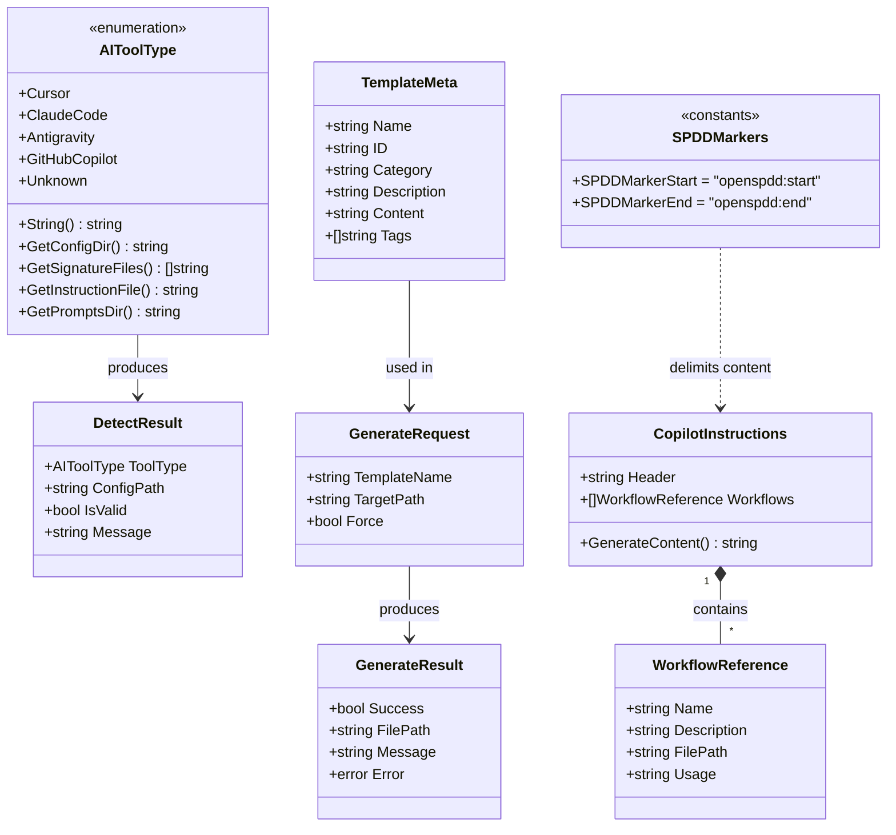

# Add GitHub Copilot Environment Support to OpenSPDD

## Requirements

Extend OpenSPDD CLI tool to support GitHub Copilot as a new AI coding environment, enabling users to generate SPDD command templates in the GitHub Copilot-compatible format with automatic environment detection and appropriate file structure generation.

**Scope**:
- Add GitHub Copilot as a recognized AI tool type alongside Cursor, Claude Code, and Antigravity
- Detect GitHub Copilot environment via `.github/` directory presence
- Generate Copilot-specific file structure: `copilot-instructions.md` + `copilot-prompts/` directory
- Adapt existing templates for Copilot's instruction-based paradigm

**Value**:
- Enable SPDD workflow for GitHub Copilot users
- Expand tool coverage to the largest AI coding assistant user base
- Maintain consistent experience across all supported environments

## Entities



## Approach

1. **Environment Detection Strategy**:
   - Add `GitHubCopilot` to `AIToolType` enumeration
   - Use `.github/` directory as the primary signature file for detection
   - Detection priority: Cursor > Claude Code > Antigravity > GitHub Copilot (to avoid false positives since `.github/` is common)
   - Return `copilot-prompts` as the config directory for template placement

2. **File Structure Generation Strategy**:
   - GitHub Copilot requires a different file structure than other tools:
     - Main instruction file: `.github/copilot-instructions.md`
     - Templates directory: `.github/copilot-prompts/`
   - The instruction file acts as a "meta-prompt" pointing to detailed templates
   - Templates are stored separately and referenced via file paths
   - **Existing File Handling (Marker-Based Merge)**:
     - Use HTML comment markers `<!-- openspdd:start -->` and `<!-- openspdd:end -->` to delimit SPDD content
     - If file exists with markers: update only the marked section
     - If file exists without markers: skip and warn user (unless --force)
     - If file doesn't exist: create with markers wrapping SPDD content

3. **Template Reuse Strategy**:
   - Reuse existing templates (spdd-generate, spdd-sync, spdd-reasons-canvas) directly without adaptation
   - Copy templates from `data/*.md` to `.github/copilot-prompts/` directory
   - Skip `copilot-instructions.md` when copying templates (it's handled separately with markers)
   - Embed template location references in copilot-instructions.md

4. **Generation Workflow**:
   - When `--tool github-copilot` or auto-detected:
     - Generate `copilot-instructions.md` with workflow overview
     - Generate all templates to `copilot-prompts/` directory
   - Use `--all` flag behavior for Copilot to always generate the instruction file

## Structure

### Inheritance Relationships
1. `AIToolType` enumeration extended with `GitHubCopilot` constant
2. `DetectorService` interface unchanged (methods work for all tool types)
3. `TemplateManager` interface extended with `GenerateForCopilot()` method
4. `EmbeddedTemplateManager` implements extended `TemplateManager` interface

### Dependencies
1. `cmd/generate.go` depends on `detector.AIToolType` for tool-specific logic
2. `cmd/init.go` depends on `detector.AIToolType` for interactive selection
3. `templates/manager.go` depends on `detector.AIToolType` for output path determination
4. `cmd/root.go` depends on `parseToolFlag()` for GitHub Copilot flag parsing

### Layered Architecture
1. **CLI Layer** (`cmd/`): Handle `github-copilot` tool flag, update interactive selection
2. **Detection Layer** (`internal/detector/`): Add GitHubCopilot type and signature detection
3. **Template Layer** (`internal/templates/`): Add Copilot-specific generation logic and instruction file generation
4. **Data Layer** (`internal/templates/data/`): Store Copilot instruction template

## Operations

### 1. Update AIToolType Enumeration - `internal/detector/types.go`

1. **Responsibility**: Define GitHub Copilot as a recognized AI tool type

2. **Changes**:
   - Add new constant `GitHubCopilot` with value `"github-copilot"`
   - Update `String()` method: when type is GitHubCopilot, return `"GitHub Copilot"`
   - Update `GetConfigDir()` method: when type is GitHubCopilot, return `".github/copilot-prompts"`
   - Update `GetSignatureFiles()` method: when type is GitHubCopilot, return a list containing `".github"`

3. **New Methods**:
   - `GetInstructionFile()`: Returns the path to the instruction file
     - For GitHubCopilot: return `".github/copilot-instructions.md"`
     - For all other types: return empty string
   - `HasInstructionFile()`: Returns whether this tool type uses an instruction file
     - For GitHubCopilot: return true
     - For all other types: return false

### 2. Update Detection Priority - `internal/detector/detector.go`

1. **Responsibility**: Detect GitHub Copilot environment with appropriate priority

2. **Changes**:
   - In the `Detect()` method, add `GitHubCopilot` to the tool types detection list
   - Detection order MUST be: Cursor → ClaudeCode → Antigravity → GitHubCopilot
   - GitHubCopilot is positioned last because `.github/` directory is common in many projects and would cause false positives if checked earlier

### 3. Update Tool Flag Parsing - `cmd/root.go`

1. **Responsibility**: Parse `github-copilot` and `copilot` as valid tool flags

2. **Changes**:
   - In `parseToolFlag()` function, add handling for GitHub Copilot aliases
   - Accepted values (case-insensitive): `"github-copilot"`, `"copilot"`, `"gh-copilot"`
   - When any of these values is matched, return the GitHubCopilot tool type
   - Update the help text for `--tool` flag to include `github-copilot` as an option

### 4. Update Interactive Tool Selection - `cmd/init.go`

1. **Responsibility**: Add GitHub Copilot to interactive selection menu

2. **Changes**:
   - In `selectToolInteractively()` function, add a new option to the selection list
   - Display label: `"GitHub Copilot"`
   - Option value: `"github-copilot"`
   - Position it after existing options (Cursor, Claude Code, Antigravity)

### 5. Create Copilot Instructions Template - `internal/templates/data/copilot-instructions.md`

1. **Responsibility**: Provide the main instruction file template for GitHub Copilot
2. **Content**: Meta-prompt that describes SPDD methodology and references template files
3. **Format**: Standard markdown without YAML frontmatter (Copilot doesn't use it)

4. **Template Content**:
   ```markdown
   # SPDD Framework for GitHub Copilot

   This project uses the SPDD (Structured Prompt-Driven Development) methodology for AI-assisted development.

   ## Available Workflows

   When I ask you to use SPDD workflows, refer to these templates:

   ### 1. REASONS-Canvas
   For structured requirement analysis and prompt generation.
   - **Template**: `.github/copilot-prompts/spdd-reasons-canvas.md`
   - **Usage**: "Use REASONS-Canvas to design [feature description]"
   - **Output**: Structured prompt file in `spdd/prompt/` directory

   ### 2. SPDD Generate
   For code generation from structured prompt files.
   - **Template**: `.github/copilot-prompts/spdd-generate.md`
   - **Usage**: "Generate code from @spdd/prompt/[filename].md"
   - **Output**: Implementation code following Operations sequence

   ### 3. SPDD Sync
   For syncing code changes back to prompt files.
   - **Template**: `.github/copilot-prompts/spdd-sync.md`
   - **Usage**: "Sync changes to @spdd/prompt/[filename].md"
   - **Output**: Updated prompt file reflecting code changes

   ## How to Use

   1. **Read the relevant template file** when I mention an SPDD workflow
   2. **Follow the steps** defined in the template
   3. **Apply the guardrails** specified in each template

   ## Quick Reference

   | Workflow | When to Use | Template Location |
   |----------|-------------|-------------------|
   | REASONS-Canvas | Starting new feature/task | `.github/copilot-prompts/spdd-reasons-canvas.md` |
   | SPDD Generate | Implementing from prompt | `.github/copilot-prompts/spdd-generate.md` |
   | SPDD Sync | After code refactoring | `.github/copilot-prompts/spdd-sync.md` |
   ```

### 6. Add New Error Constant - `internal/errors.go`

1. **Responsibility**: Define error for marker-based merge conflict

2. **Changes**:
   - Add a new exported error variable named `ErrExistingFileNoMarkers`
   - Error message: `"file exists without SPDD markers"`
   - This error is returned when attempting to update an existing `copilot-instructions.md` that doesn't contain the SPDD markers

### 7. Extend TemplateManager Interface - `internal/templates/manager.go`

1. **Responsibility**: Add method for Copilot-specific generation

2. **New Method**: `GenerateForCopilot`
   - **Parameters**:
     - `targetDir`: The root directory of the project (where `.github/` will be created)
     - `force`: Boolean flag indicating whether to overwrite existing files without markers
   - **Returns**: A list of generation results (one for each file generated)

3. **Method Behavior**:
   - Generate `copilot-instructions.md` to the `.github/` directory
   - Copy existing templates to `.github/copilot-prompts/` directory
   - Return a result for each file indicating success/failure and any messages

### 8. Implement GenerateForCopilot - `internal/templates/manager.go`

1. **Responsibility**: Generate complete Copilot file structure with marker-based merge support

2. **Constants to Define**:
   - `SPDDMarkerStart`: `"<!-- openspdd:start -->"`
   - `SPDDMarkerEnd`: `"<!-- openspdd:end -->"`

3. **Main Method Logic** (`GenerateForCopilot`):

   **Step 1**: Create directory structure
   - Construct the path to `.github/` directory under the target directory
   - Create the directory if it doesn't exist (with permissions 0755)

   **Step 2**: Handle instruction file with marker-based merge
   - Construct the path to `copilot-instructions.md` inside `.github/`
   - Generate the SPDD instruction content (the template content from Operation 5)
   - Wrap the content with start and end markers (marker → newline → content → newline → marker)
   - Call the instruction file write helper (see below)
   - Add the result to the results list

   **Step 3**: Generate templates to prompts directory
   - Construct the path to `copilot-prompts/` inside `.github/`
   - Create the directory if it doesn't exist
   - Iterate through all embedded templates from `data/`
   - Skip `copilot-instructions.md` (already handled in Step 2)
   - For each template, write it to the prompts directory
   - Add each result to the results list

   **Step 4**: Return all results

4. **Helper Method Logic** (`writeInstructionFile`):

   **Input**: file path, marked content (with markers), force flag

   **Decision Tree**:
   
   - **Try to read existing file**
     - If file doesn't exist (read error):
       - Create new file with the marked content
       - Return success result
     
     - If file exists:
       - Check if content contains BOTH start marker AND end marker
       
       - **If both markers found**:
         - Find the position of start marker
         - Find the position of end marker (including marker length)
         - Replace everything from start marker to end marker with new marked content
         - Preserve all content before start marker
         - Preserve all content after end marker
         - Write the updated content to file
         - Return success result
       
       - **If markers NOT found and force flag is TRUE**:
         - Overwrite the entire file with marked content
         - Return success result
       
       - **If markers NOT found and force flag is FALSE**:
         - Do NOT modify the file
         - Return failure result with:
           - Success: false
           - FilePath: the file path
           - Message: "file exists without SPDD markers. Use --force to overwrite, or manually add markers"
           - Error: ErrExistingFileNoMarkers

### 9. Update Generate Command - `cmd/generate.go`

1. **Responsibility**: Handle Copilot-specific generation flow

2. **Changes in `generateAllTemplates()` function**:
   - At the beginning of the function, check if the detected tool type is GitHubCopilot
   - **If GitHubCopilot**:
     - Call `GenerateForCopilot()` method on the template manager with target directory and force flag
     - Iterate through the returned results
     - For each successful result, render a success message showing the generated file path
     - For each failed result, render an error message showing the failure reason
     - Return early (do not proceed with standard generation logic)
   - **If NOT GitHubCopilot**:
     - Continue with existing generation logic (no changes needed)

### 10. Update Init Command - `cmd/init.go`

1. **Responsibility**: Initialize Copilot directory structure

2. **Changes**:
   - After creating the config directory, add special handling for GitHubCopilot
   - **If detected tool type is GitHubCopilot**:
     - Construct path to `.github/copilot-prompts/` under the working directory
     - Create this directory if it doesn't exist (with permissions 0755)
     - This creates the complete directory structure needed for Copilot templates
   - The standard config path creation already handles `.github/` parent directory
   - Optionally: prompt user if they want to generate the instruction file immediately

### 11. Update README Documentation - `README.md`

1. **Responsibility**: Document GitHub Copilot support
2. **Sections to Update**:
   - Add GitHub Copilot to "Supported Environments" table
   - Add usage examples with `--tool github-copilot`
   - Add file structure explanation for Copilot

## Norms

1. **Enumeration Extension Pattern**:
   - New enum values added at end before `Unknown`
   - All switch statements must handle new enum value
   - Default case returns empty/false for new methods on other types

2. **Detection Priority Convention**:
   - More specific signatures first (`.cursor/`, `.claude/`)
   - Generic signatures last (`.github/` is common in many projects)
   - Document priority reasoning in code comments

3. **Template Reuse Standards**:
   - Reuse existing templates from `data/` directory directly
   - Templates are copied as-is to `.github/copilot-prompts/`
   - No separate Copilot-specific template versions needed
   - `copilot-instructions.md` provides the meta-prompt referencing template locations

4. **File Path Conventions**:
   - Instruction file: `.github/copilot-instructions.md`
   - Templates directory: `.github/copilot-prompts/`
   - Template files: `spdd-*.md` (same naming as other tools)

5. **Error Handling**:
   - Return descriptive error messages for file operations
   - Use existing `internal.ErrFileExists` for consistency
   - Add new `internal.ErrExistingFileNoMarkers` for marker-based merge conflicts
   - Log warnings for non-critical failures

6. **Testing Requirements**:
   - Unit tests for new `AIToolType` methods
   - Unit tests for detection priority
   - Integration tests for Copilot file generation

## Safeguards

1. **Detection Priority Constraints**:
   - GitHub Copilot detection MUST be last in priority order
   - MUST NOT trigger on repositories without explicit Copilot setup intent
   - Consider adding secondary signature (e.g., `.github/copilot-*` files) for stricter detection

2. **Backward Compatibility**:
   - Existing detection for Cursor, Claude Code, Antigravity MUST NOT change behavior
   - Existing template generation MUST NOT be affected
   - All existing tests MUST continue to pass

3. **File Operation Safety (Marker-Based Merge)**:
   - MUST use `<!-- openspdd:start -->` and `<!-- openspdd:end -->` markers to delimit SPDD content
   - **File doesn't exist**: Create new file with SPDD content wrapped in markers
   - **File exists with markers**: Replace ONLY the content between markers, preserve everything else
   - **File exists without markers + no --force**: Skip generation, return warning with suggestion to use --force or add markers manually
   - **File exists without markers + --force**: Overwrite entire file with marked SPDD content
   - MUST NOT modify existing `.github/` contents other than copilot-specific files
   - Marker format MUST be exactly: `<!-- openspdd:start -->` and `<!-- openspdd:end -->` (HTML comments for markdown compatibility)

4. **Template Integrity**:
   - Templates are copied as-is without modification
   - Original YAML frontmatter is preserved (GitHub Copilot ignores it)
   - All Steps and Guardrails remain intact

5. **Flag Parsing Constraints**:
   - MUST accept `github-copilot`, `copilot`, `gh-copilot` as aliases
   - MUST be case-insensitive
   - MUST NOT conflict with existing flag values

6. **Documentation Constraints**:
   - README MUST be updated with Copilot support information
   - Usage examples MUST be provided
   - File structure MUST be documented

7. **Error Message Standards**:
   - Error messages MUST clearly indicate Copilot-specific context
   - MUST suggest resolution steps for common errors
   - MUST NOT expose internal implementation details
