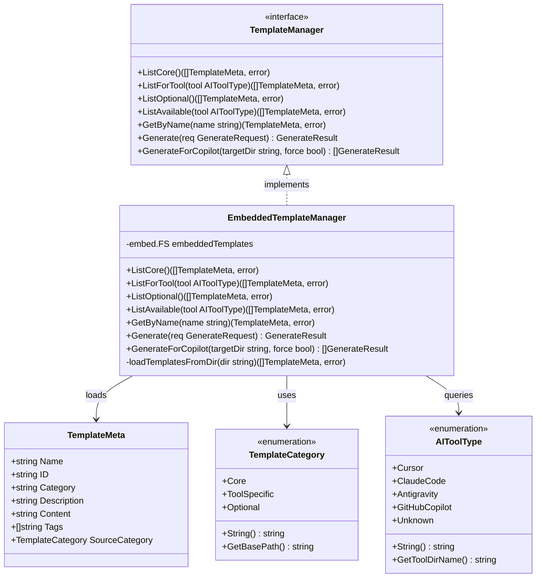

# Template Directory Hierarchical Restructure for Default/Tool-Specific/Optional Classification

## Requirements

- Refactor the embedded template directory structure from flat to hierarchical organization, enabling clear distinction between core (default), tool-specific, and optional templates.
- Ensure `spdd list` command displays only relevant templates based on detected environment.
- Ensure `spdd generate --all` generates only core templates plus current environment's tool-specific templates, preventing cross-environment template leakage.
- Maintain backward compatibility with existing Copilot marker-based merge functionality.
- Provide extensibility for future optional templates without code changes.

---

## Entities



---

## Approach

1. **Directory Structure Strategy**:
   - Adopt three-tier hierarchical structure: `core/`, `tools/{tool-name}/`, `optional/`
   - Use directory path as implicit category indicator, eliminating need for explicit metadata field
   - Handle Go embed limitation for empty directories by graceful error handling rather than placeholder files

2. **Template Loading Strategy**:
   - Implement separate loading methods for each category directory
   - Use `fs.ReadDir` with nested path support for hierarchical traversal
   - Cache loaded templates to avoid repeated filesystem access during single command execution

3. **Tool-Specific Template Mapping**:
   - Map `AIToolType` enum values to directory names under `tools/`
   - Directory naming convention: lowercase with hyphens (e.g., `claude-code`, `github-copilot`)
   - Tool-specific templates inherit special handling logic (e.g., Copilot instruction file marker-based merge)

4. **Command Behavior Adaptation**:
   - `list` command: Default shows `ListAvailable(detectedTool)`, with `--optional` and `--all` flags for extended views
   - `generate` command: `--all` flag triggers core + tool-specific generation, respecting environment detection
   - Interactive selection: Only shows templates from `ListAvailable(detectedTool)`

5. **Embed Directive Strategy**:
   - Use multiple explicit embed patterns to handle nested structure
   - Pattern: `data/core/*.md`, `data/tools/*/*.md`, `data/optional/*.md`
   - Gracefully handle missing directories (e.g., empty `tools/cursor/`)

---

## Structure

### Inheritance Relationships
1. `TemplateManager` interface defines template operation contracts
2. `EmbeddedTemplateManager` implements `TemplateManager` interface
3. `TemplateCategory` enumeration defines template classification types

### Dependencies
1. `cmd/list.go` depends on `TemplateManager.ListAvailable()`, `ListOptional()`
2. `cmd/generate.go` depends on `TemplateManager.ListCore()`, `ListForTool()`, `Generate()`
3. `internal/templates/manager.go` depends on `embed.FS` and `detector.AIToolType`
4. `internal/templates/embed.go` embeds hierarchical directory structure

### Layered Architecture
1. **Command Layer** (`cmd/`): Parse flags, orchestrate template listing/generation with environment awareness
2. **Template Layer** (`internal/templates/`): Manage template loading, categorization, and generation logic
3. **Detection Layer** (`internal/detector/`): Provide `AIToolType` for tool-specific template resolution
4. **Resource Layer** (`internal/templates/data/`): Embedded template files in hierarchical structure

### Target Directory Layout
```
internal/templates/data/
├── core/
│   ├── spdd-generate.md
│   ├── spdd-sync.md
│   └── spdd-reasons-canvas.md
├── tools/
│   ├── cursor/
│   ├── claude-code/
│   ├── copilot/
│   │   └── copilot-instructions.md
│   └── antigravity/
└── optional/
```

---

## Operations

### Operation 1: Move Template Files to Hierarchical Structure

1. **Responsibility**: Reorganize existing template files into the new directory structure
2. **Actions**:
   - Create directory `internal/templates/data/core/`
   - Create directory `internal/templates/data/tools/copilot/`
   - Create directory `internal/templates/data/tools/cursor/` (empty, for future use)
   - Create directory `internal/templates/data/tools/claude-code/` (empty, for future use)
   - Create directory `internal/templates/data/tools/antigravity/` (empty, for future use)
   - Create directory `internal/templates/data/optional/` (empty, for future use)
   - Move `data/spdd-generate.md` to `data/core/spdd-generate.md`
   - Move `data/spdd-sync.md` to `data/core/spdd-sync.md`
   - Move `data/spdd-reasons-canvas.md` to `data/core/spdd-reasons-canvas.md`
   - Move `data/copilot-instructions.md` to `data/tools/copilot/copilot-instructions.md`
   - Delete original files from `data/` root after successful moves

### Operation 2: Update embed.go with Hierarchical Embed Directives

1. **Responsibility**: Modify embed directive to support nested directory structure
2. **File**: `internal/templates/embed.go`
3. **Changes**:
   - Replace single `//go:embed data/*.md` directive
   - Add new directive: `//go:embed all:data`
   - This embeds entire data directory tree including subdirectories
4. **Alternative Approach** (if `all:` prefix not desired):
   - Use explicit patterns: `//go:embed data/core/*.md data/tools/*/*.md data/optional/*.md`
   - Note: This approach requires at least one matching file per pattern, empty directories will cause build errors

### Operation 3: Add GetToolDirName Method to AIToolType

1. **Responsibility**: Map AIToolType enum to directory name under `tools/`
2. **File**: `internal/detector/types.go`
3. **New Method**: `GetToolDirName() string`
   - Logic:
     - For `Cursor`: return `"cursor"`
     - For `ClaudeCode`: return `"claude-code"`
     - For `Antigravity`: return `"antigravity"`
     - For `GitHubCopilot`: return `"copilot"`
     - For `Unknown`: return empty string `""`

### Operation 4: Refactor TemplateManager Interface

1. **Responsibility**: Extend interface with category-aware listing methods
2. **File**: `internal/templates/manager.go`
3. **Interface Changes**:
   - Add method `ListCore() ([]TemplateMeta, error)`
     - Returns templates from `data/core/` directory
   - Add method `ListForTool(tool AIToolType) ([]TemplateMeta, error)`
     - Returns templates from `data/tools/{tool.GetToolDirName()}/` directory
     - Returns empty slice if directory doesn't exist or tool is Unknown
   - Add method `ListOptional() ([]TemplateMeta, error)`
     - Returns templates from `data/optional/` directory
   - Add method `ListAvailable(tool AIToolType) ([]TemplateMeta, error)`
     - Returns combined result of `ListCore()` + `ListForTool(tool)`
     - This is the primary method for user-facing template listing
4. **Existing Method Changes**:
   - Modify `ListAll()` to return ALL templates across all categories (core + all tools + optional)
   - This method is used for administrative/debugging purposes only

### Operation 5: Implement loadTemplatesFromDir Helper Method

1. **Responsibility**: Load and parse templates from a specific embedded directory path
2. **File**: `internal/templates/manager.go`
3. **Method**: `loadTemplatesFromDir(dir string) ([]TemplateMeta, error)`
4. **Logic**:
   - Use `fs.ReadDir(embeddedTemplates, dir)` to list directory entries
   - If directory doesn't exist, return empty slice (not an error)
   - For each `.md` file entry:
     - Read file content using `fs.ReadFile(embeddedTemplates, path)`
     - Parse frontmatter using existing `ParseFrontmatter()` function
     - Set `ID` from filename if not present in frontmatter
     - Append to result slice
   - Sort result by template Name alphabetically
   - Return sorted slice

### Operation 6: Implement ListCore Method

1. **Responsibility**: Return all core templates that should be installed by default
2. **File**: `internal/templates/manager.go`
3. **Method**: `ListCore() ([]TemplateMeta, error)`
4. **Logic**:
   - Call `loadTemplatesFromDir("data/core")`
   - Return result directly

### Operation 7: Implement ListForTool Method

1. **Responsibility**: Return tool-specific templates for the given AI tool type
2. **File**: `internal/templates/manager.go`
3. **Method**: `ListForTool(tool AIToolType) ([]TemplateMeta, error)`
4. **Logic**:
   - If `tool == Unknown`, return empty slice
   - Get directory name via `tool.GetToolDirName()`
   - Construct path: `"data/tools/" + dirName`
   - Call `loadTemplatesFromDir(path)`
   - Return result

### Operation 8: Implement ListOptional Method

1. **Responsibility**: Return all optional templates available for manual selection
2. **File**: `internal/templates/manager.go`
3. **Method**: `ListOptional() ([]TemplateMeta, error)`
4. **Logic**:
   - Call `loadTemplatesFromDir("data/optional")`
   - Return result directly

### Operation 9: Implement ListAvailable Method

1. **Responsibility**: Return all templates available for the current environment
2. **File**: `internal/templates/manager.go`
3. **Method**: `ListAvailable(tool AIToolType) ([]TemplateMeta, error)`
4. **Logic**:
   - Call `ListCore()` to get core templates
   - Call `ListForTool(tool)` to get tool-specific templates
   - Merge both slices
   - Sort merged result by Name alphabetically
   - Return merged and sorted slice

### Operation 10: Refactor ListAll Method

1. **Responsibility**: Return ALL templates across all categories (for admin/debug use)
2. **File**: `internal/templates/manager.go`
3. **Method**: `ListAll() ([]TemplateMeta, error)`
4. **Logic**:
   - Call `ListCore()` to get core templates
   - For each known AIToolType (Cursor, ClaudeCode, Antigravity, GitHubCopilot):
     - Call `ListForTool(toolType)` and append results
   - Call `ListOptional()` and append results
   - Remove duplicates based on template ID
   - Sort by Name alphabetically
   - Return combined result

### Operation 11: Update GetByName Method

1. **Responsibility**: Find template by name across all categories
2. **File**: `internal/templates/manager.go`
3. **Method**: `GetByName(name string) (TemplateMeta, error)`
4. **Logic**:
   - Call `ListAll()` to search across all categories
   - Perform case-insensitive match on both `Name` and `ID` fields
   - Return first match or `ErrTemplateNotFound`

### Operation 12: Update GenerateForCopilot Method

1. **Responsibility**: Adjust template source paths for new directory structure
2. **File**: `internal/templates/manager.go`
3. **Changes**:
   - Update instruction file read path from `"data/copilot-instructions.md"` to `"data/tools/copilot/copilot-instructions.md"`
   - Update template iteration to use `ListCore()` instead of reading from `"data"` directory
   - Keep marker-based merge logic unchanged

### Operation 13: Update list Command

1. **Responsibility**: Adapt list command to use environment-aware template listing
2. **File**: `cmd/list.go`
3. **Changes**:
   - Add new flag `--optional` (bool): When set, list optional templates instead of available
   - Add new flag `--all` (bool): When set, list all templates across all categories
   - Modify Run function logic:
     - If `--all` flag: call `templateManager.ListAll()`
     - Else if `--optional` flag: call `templateManager.ListOptional()`
     - Else: call `templateManager.ListAvailable(detectedResult.ToolType)`
   - Keep existing `--category` and `--quiet` flags functional

### Operation 14: Update generate Command - generateAllTemplates Function

1. **Responsibility**: Generate only core + current tool-specific templates with --all flag
2. **File**: `cmd/generate.go`
3. **Changes to `generateAllTemplates(targetDir string)`**:
   - For GitHubCopilot: Keep existing `GenerateForCopilot()` call (already handles core + copilot-specific)
   - For other tools:
     - Replace `templateManager.ListAll()` with `templateManager.ListAvailable(detectedResult.ToolType)`
     - This ensures only core templates are generated, excluding other tools' templates

### Operation 15: Update generate Command - generateInteractively Function

1. **Responsibility**: Show only available templates in interactive selection
2. **File**: `cmd/generate.go`
3. **Changes to `generateInteractively(targetDir string)`**:
   - Replace `templateManager.ListAll()` with `templateManager.ListAvailable(detectedResult.ToolType)`
   - This ensures interactive selection only shows relevant templates for current environment

---

## Norms

1. **Directory Naming Standards**:
   - Top-level categories: lowercase singular (`core`, `optional`)
   - Tool directories: lowercase with hyphens matching `AIToolType.GetToolDirName()` output
   - Template files: kebab-case with `.md` extension

2. **Embed Directive Standards**:
   - Use `//go:embed all:data` for recursive embedding of entire data directory
   - Alternative explicit patterns must ensure at least one matching file exists

3. **Method Naming Convention**:
   - `List*` prefix for methods returning template slices
   - `ListAvailable` as primary user-facing method
   - `ListAll` reserved for administrative purposes

4. **Error Handling**:
   - Missing directories should return empty slices, not errors
   - Maintain existing error types (`ErrTemplateNotFound`, etc.)
   - Log warnings for unexpected directory read failures

5. **Template ID Uniqueness**:
   - Template IDs must be globally unique across all categories
   - ID derived from filename if not specified in frontmatter
   - Conflict detection should warn at build/test time

6. **Backward Compatibility**:
   - Existing `Generate()` method behavior unchanged
   - Existing `GenerateForCopilot()` marker-based merge logic preserved
   - Command flags remain compatible with previous versions

---

## Safeguards

1. **Build-Time Validation**:
   - Embed directive MUST successfully compile with hierarchical structure
   - If using explicit patterns, ensure at least one file exists per pattern or use `all:` prefix

2. **Template Isolation**:
   - Tool-specific templates MUST NOT appear in other tools' template lists
   - `ListAvailable(Cursor)` MUST NOT include `copilot-instructions.md`
   - `ListAvailable(GitHubCopilot)` MUST include both core templates and `copilot-instructions.md`

3. **Empty Directory Handling**:
   - `ListForTool()` MUST return empty slice (not error) for tools with no specific templates
   - `ListOptional()` MUST return empty slice when `optional/` directory is empty

4. **File Operation Safety**:
   - File moves MUST be verified before deleting originals
   - All existing tests MUST pass after restructure

5. **Copilot Special Handling**:
   - `copilot-instructions.md` marker-based merge logic MUST remain functional
   - Instruction file MUST be generated to `.github/copilot-instructions.md` (not prompts directory)
   - Core templates for Copilot MUST be generated to `.github/copilot-prompts/`

6. **Command Flag Compatibility**:
   - `spdd list` without flags MUST show environment-aware available templates
   - `spdd generate --all` MUST NOT generate other tools' specific templates
   - New `--optional` and `--all` flags for list command MUST be additive, not breaking

7. **Test Coverage Requirements**:
   - Unit tests for each new `List*` method
   - Integration tests for `list` command with different detected environments
   - Integration tests for `generate --all` with different detected environments
