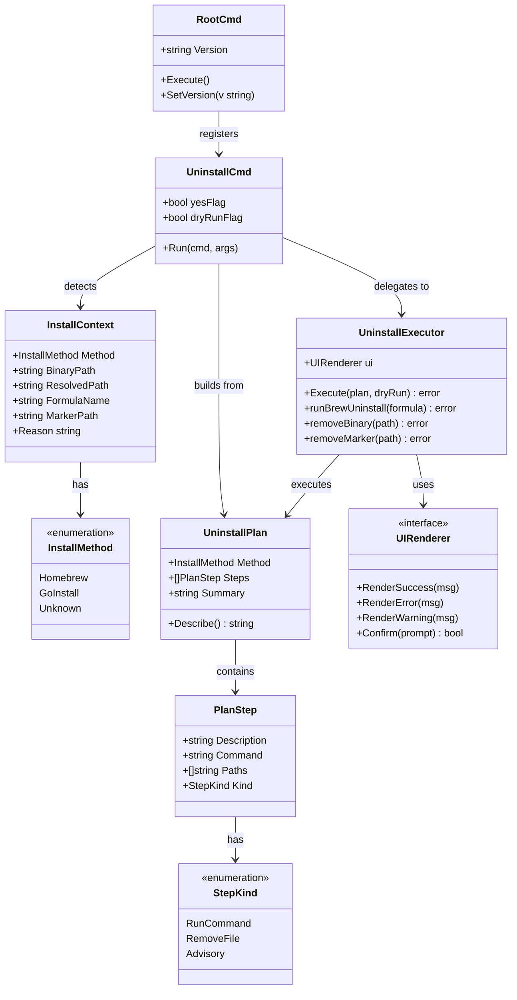

# Add `-v` Version Flag and `uninstall` Subcommand to openspdd CLI

## Requirements

Implement self-identification and self-removal capabilities in the `openspdd` CLI so that users can answer two questions without leaving the terminal: *"which version am I running?"* and *"how do I cleanly remove this tool?"*. The first capability surfaces build metadata that is already injected by the release pipeline but is currently dropped on the floor. The second capability detects how the running binary was installed (Homebrew via the project's tap, or `go install` into `$GOBIN`) and then either shells out to the matching package manager or removes the binary file directly — always after explicit user confirmation, never touching files outside openspdd's own footprint, and always degrading to clear manual instructions when auto-removal is not safe.

Boundaries:
- **In scope**: a `-v` / `--version` flag on `openspdd`; an `uninstall` subcommand covering Homebrew and `go install`; cleanup of openspdd's own residual config-marker file; clear fallback messaging when the install method is ambiguous or when the platform (Windows) cannot self-delete a running binary.
- **Out of scope**: removing user-owned generated templates inside user projects (`.cursor/commands/spdd-*.md`, etc.); removing the Homebrew tap (`gszhangwei/tools`); auto-update or self-update behavior; structured machine-readable version output (e.g., JSON).

## Entities



## Approach

1. **Version Wiring**:
   - **Strategy**: leverage Cobra's built-in `Version` field on `rootCmd`, and override the auto-generated `version` flag so it gains a `-v` short alias. Customize the version output template so the message is a single line: `openspdd <version>`.
   - **Build-time injection**: keep the variable in `cmd/openspdd/main.go` (named `version`) to honor the existing `.goreleaser.yaml` ldflag `-X main.version={{.Version}}`. No goreleaser change required.
   - **Default value**: the variable is initialized to `"dev"` so plain `go build` / `go run` produces a sensible value.
   - **Wiring direction**: `main` calls a one-line setter `cmd.SetVersion(version)` before `cmd.Execute()`. `SetVersion` assigns to `rootCmd.Version` and replaces the cobra-auto `version` flag with a `BoolVarP(&versionFlag, "version", "v", false, "...")` definition (or, if Cobra already added the flag, looks it up and sets `Shorthand = "v"`).
   - **Side-effect fix**: the Homebrew formula's smoke test `system "#{bin}/openspdd", "--version"` becomes correct.

2. **Install Method Detection**:
   - **Strategy**: classify by the *resolved* path of the running binary (`os.Executable` + `filepath.EvalSymlinks`). The classification rules:
     - Resolved path contains `/Cellar/openspdd/` (with optional `/opt/homebrew` or `/usr/local` prefix on macOS, or `/home/linuxbrew/.linuxbrew/Cellar/openspdd/` on Linux) ⇒ `Homebrew`.
     - Resolved path equals `<GOBIN>/openspdd` or `<GOPATH>/bin/openspdd` (where these are read once via `go env`, with graceful fallback if `go` is not installed) ⇒ `GoInstall`.
     - Otherwise ⇒ `Unknown`.
   - **Reuse**: factor out the existing `os.Executable() + EvalSymlinks` snippet from `cmd/pathcheck.go::guessInstallDir` so the `pathcheck` helper and the new uninstall helper share one resolver.
   - **Defensiveness**: detection never reads or writes; it produces an `InstallContext` value used by the next step.

3. **Uninstall Plan Construction**:
   - **Strategy**: each `InstallMethod` maps to a deterministic `UninstallPlan` (a list of `PlanStep`s). The plan is *data*, not action — it can be displayed (dry-run) or executed.
   - **Homebrew plan**: one `RunCommand` step (`brew uninstall gszhangwei/tools/openspdd`) followed by an optional `RemoveFile` step for the marker file.
   - **GoInstall plan**: one `RemoveFile` step targeting the resolved binary path, followed by an optional `RemoveFile` step for the marker file. Replaced by an `Advisory` step on Windows.
   - **Unknown plan**: a single `Advisory` step explaining that auto-uninstall is not safe and printing the resolved path.
   - **Marker path**: derived via `os.UserConfigDir() + "/openspdd/.path-hint-shown"` — same logic already in `cmd/pathcheck.go::pathHintMarkerPath`. Reused, not duplicated.

4. **Uninstall UX (Hybrid Model)**:
   - **Strategy**: print the plan, ask `Confirm("Proceed with uninstall?")` via the existing `uiRenderer.Confirm`, then hand off to the `UninstallExecutor`. Provide two flags:
     - `--dry-run`: print the plan and exit 0 without executing.
     - `--yes` / `-y`: skip the confirmation prompt for scripted use.
   - **Output discipline**: the plan output uses the existing `RenderSuccess` / `RenderWarning` styles for visual consistency with the rest of the CLI. Errors (e.g., `brew uninstall` non-zero exit, missing `brew` on PATH) are rendered via `RenderError` and propagate as a non-zero exit code.

5. **Execution Safety**:
   - **Brew path**: `exec.LookPath("brew")` first; if absent, fall back to the *Unknown* advisory plan (never silently skip).
   - **GoInstall path**: `os.Remove(binaryPath)`; on macOS/Linux this is well-defined for a running binary. On Windows (`runtime.GOOS == "windows"`), the executor refuses removal and prints the exact `del` command for the user.
   - **Marker cleanup**: `os.Remove(markerPath)` is always best-effort; an `os.IsNotExist` error is silently swallowed; any other error is rendered as a warning but does not fail the overall uninstall.
   - **Post-uninstall sanity check**: re-run `exec.LookPath("openspdd")`; if a *different* openspdd binary is still reachable on PATH, render an advisory warning identifying its location so the user knows there is a second copy.

6. **Error Handling Strategy**:
   - **No new exception types** — Go errors are returned, surfaced via `RenderError`, and the process exits non-zero (`os.Exit(1)`).
   - **Subprocess errors** (`brew uninstall` failure) are wrapped with the captured stdout/stderr text so the user sees the underlying cause without re-running.
   - **No panics** for expected failure paths (missing `brew`, missing marker, unknown install method); panics are reserved for true programmer errors.

## Structure

### Inheritance Relationships

1. `*cobra.Command` — provided by `github.com/spf13/cobra`. The new `uninstallCmd` is a `*cobra.Command` value (not an interface implementer); follows the same pattern as `initCmd`, `listCmd`, `generateCmd`.
2. `InstallMethod` — declared as `type InstallMethod string` (mirrors `detector.AIToolType` convention) with constants `MethodHomebrew`, `MethodGoInstall`, `MethodUnknown`.
3. `StepKind` — declared as `type StepKind string` with constants `StepRunCommand`, `StepRemoveFile`, `StepAdvisory`.
4. `UninstallExecutor` — concrete struct; no interface needed at this stage (single implementation, single caller). May be promoted to an interface only if tests demand it.

### Dependencies

1. `cmd/openspdd/main.go` depends on `cmd` package (already does) and additionally calls `cmd.SetVersion(version)`.
2. `cmd/root.go` exposes `SetVersion(string)` and configures `rootCmd.Version` + the `version` flag's `-v` shortcut.
3. `cmd/uninstall.go` depends on:
   - `os`, `os/exec`, `path/filepath`, `runtime`, `strings`, `fmt` — standard library.
   - `github.com/spf13/cobra` — already a project dependency.
   - `github.com/gszhangwei/open-spdd/internal/ui` — for `uiRenderer.Confirm` / `Render*`.
   - `cmd/pathcheck.go` (same package) — reuses the binary-path resolver and the marker-path helper.
4. `cmd/uninstall.go` registers itself on `rootCmd` via `rootCmd.AddCommand(uninstallCmd)` inside `init()`, following the same pattern as the other subcommands.

### Layered Architecture

1. **Entry Layer** (`cmd/openspdd/main.go`): owns the package-level `version` string. Calls `cmd.SetVersion(version)`, then `cmd.Execute()`.
2. **CLI / Wiring Layer** (`cmd/root.go`): owns Cobra's `rootCmd`. Provides `SetVersion(string)` to inject the build-time version. Owns the `--version` / `-v` flag wiring and the version output template.
3. **Subcommand Layer** (`cmd/uninstall.go`): the `uninstall` Cobra command, its flags, and its `Run` callback orchestrating detection → plan → confirm → execute.
4. **Detection Layer** (`cmd/uninstall.go` helpers, optionally promoted to a small `internal/installinfo` package if reuse demand grows): functions `detectInstallContext()`, `classifyByPath()`, `findGoBin()`. Pure (no I/O side effects beyond reading `os.Executable`, `go env`, and filesystem stat).
5. **Planning Layer** (`cmd/uninstall.go`): `buildPlan(ctx InstallContext) UninstallPlan`. Pure transformation, easy to unit-test.
6. **Execution Layer** (`cmd/uninstall.go`): `(*UninstallExecutor).Execute(plan, dryRun)`. The only place that calls `os.Remove`, `exec.Command`, or other state-mutating operations.
7. **UI Layer** (existing `internal/ui`): unchanged; `uiRenderer.Confirm` and `Render*` methods are reused as-is.
8. **Test Layer** (`tests/cmd/`): new test files mirror existing layout. Pure functions (`classifyByPath`, `buildPlan`) are table-driven tested; the executor is tested with a stub command runner injected at the function-variable level (e.g., `var execCommand = exec.Command` overridable in tests).

## Operations

### Operation 1: Declare and inject `version` build-time variable

1. **Component type**: package-level variable in entry point.
2. **File**: `cmd/openspdd/main.go`.
3. **Responsibility**: hold the build-time version string injected by goreleaser via `-X main.version={{.Version}}`; provide a sane default for non-release builds; pass the value to the `cmd` package before invoking the CLI.
4. **Changes**:
   - Add a package-level variable: `var version = "dev"`.
   - In `main()`, call `cmd.SetVersion(version)` *before* `cmd.Execute()`.
5. **Resulting file content** (replace whole file):

   ```go
   package main

   import "github.com/gszhangwei/open-spdd/cmd"

   var version = "dev"

   func main() {
       cmd.SetVersion(version)
       cmd.Execute()
   }
   ```

6. **Constraints**:
   - The variable name MUST remain exactly `version` (lowercase, no other identifier) — `.goreleaser.yaml` references `main.version` literally.
   - The default value MUST NOT be empty; an empty default would make Cobra hide the version flag.

### Operation 2: Wire `--version` / `-v` flag on rootCmd via `SetVersion`

1. **Component type**: function added to existing `cmd` package.
2. **File**: `cmd/root.go`.
3. **Responsibility**: receive the build-time version from `main`, configure Cobra's built-in version handling on `rootCmd`, and override the auto-generated flag definition so it accepts the `-v` short alias.
4. **Changes**:
   - Add an exported function `SetVersion(v string)` in `cmd/root.go`.
   - The function MUST:
     - Trim `v`; if empty after trim, default to `"dev"`.
     - Assign to `rootCmd.Version`.
     - Set the version output template via `rootCmd.SetVersionTemplate("openspdd {{.Version}}\n")` so that both `-v` and `--version` print exactly `openspdd <version>` on a single line.
     - Look up `rootCmd.Flags().Lookup("version")` (Cobra adds it lazily; if `nil`, the function MUST register a fresh flag via `rootCmd.Flags().BoolP("version", "v", false, "Print openspdd version and exit")` instead). If the lookup returns non-nil, set `flag.Shorthand = "v"` and `flag.Usage = "Print openspdd version and exit"`.
5. **Order constraint**: `SetVersion` MUST be invoked from `main` *before* `Execute()`. Order is enforced by code review, not runtime — there is no second injection point.
6. **Constraints**:
   - MUST NOT introduce any persistent flag named `verbose` or any other flag claiming the `v` shorthand on `rootCmd`.
   - MUST NOT call `os.Exit` from `SetVersion`.
   - MUST be idempotent — calling twice with the same value is a no-op.

### Operation 3: Add `InstallMethod`, `InstallContext`, `PlanStep`, `UninstallPlan` types

1. **Component type**: type declarations.
2. **File**: `cmd/uninstall.go` (new file in existing `cmd` package).
3. **Responsibility**: provide the value types used by detection, planning, and execution. Pure data, no behavior beyond a small `Describe()` formatter on `UninstallPlan`.
4. **Type declarations**:

   ```go
   type InstallMethod string

   const (
       MethodHomebrew  InstallMethod = "homebrew"
       MethodGoInstall InstallMethod = "go-install"
       MethodUnknown   InstallMethod = "unknown"
   )

   type InstallContext struct {
       Method       InstallMethod
       BinaryPath   string // raw os.Executable() result
       ResolvedPath string // after EvalSymlinks
       FormulaName  string // populated only for Homebrew, fixed value
       MarkerPath   string // <UserConfigDir>/openspdd/.path-hint-shown
       Reason       string // human-readable classification rationale
   }

   type StepKind string

   const (
       StepRunCommand StepKind = "run-command"
       StepRemoveFile StepKind = "remove-file"
       StepAdvisory   StepKind = "advisory"
   )

   type PlanStep struct {
       Kind        StepKind
       Description string   // shown to user in the plan
       Command     string   // populated when Kind == StepRunCommand (display form, e.g., "brew uninstall gszhangwei/tools/openspdd")
       Args        []string // populated when Kind == StepRunCommand (argv excluding program)
       Program     string   // populated when Kind == StepRunCommand (e.g., "brew")
       Paths       []string // populated when Kind == StepRemoveFile
       Optional    bool     // true for marker cleanup (failure should not abort)
   }

   type UninstallPlan struct {
       Method  InstallMethod
       Steps   []PlanStep
       Summary string
   }
   ```

5. **Method**:
   - `(p UninstallPlan) Describe() string` — returns a multi-line human-readable representation of the plan, used by both the "show before confirm" UX and the `--dry-run` UX.
6. **Constraints**:
   - All fields are exported only insofar as tests need them; package-internal callers can use them directly.
   - No methods may perform I/O.

### Operation 4: Implement install method detection

1. **Component type**: helper functions.
2. **File**: `cmd/uninstall.go`.
3. **Responsibility**: produce an `InstallContext` from runtime introspection.
4. **Functions**:
   - `detectInstallContext() InstallContext`
     - **Logic**:
       1. `binaryPath, err := os.Executable()`. If `err != nil`, return `InstallContext{Method: MethodUnknown, Reason: "could not determine executable path: " + err.Error()}`.
       2. `resolved, err := filepath.EvalSymlinks(binaryPath)`. If `err != nil`, fall back to `resolved = binaryPath`.
       3. `method, reason := classifyByPath(resolved)`.
       4. Compute `markerPath` via the existing `pathHintMarkerPath()` helper (already in `cmd/pathcheck.go`, same package, returns empty string on failure — accept that).
       5. Build and return `InstallContext{Method: method, BinaryPath: binaryPath, ResolvedPath: resolved, MarkerPath: markerPath, Reason: reason, FormulaName: homebrewFormulaName /* if Homebrew */}`.

   - `classifyByPath(resolved string) (InstallMethod, string)`
     - **Logic**:
       1. Use `filepath.ToSlash(resolved)` for cross-platform substring checks.
       2. If it contains `/Cellar/openspdd/` ⇒ return `MethodHomebrew, "binary resolved under Homebrew Cellar"`.
       3. Otherwise compute candidate Go-install paths via `findGoBin()`. If any candidate equals the directory of `resolved` ⇒ return `MethodGoInstall, "binary located in <gobin>"`.
       4. Otherwise return `MethodUnknown, "binary path matched neither Homebrew Cellar nor a Go bin directory"`.

   - `findGoBin() []string`
     - **Logic**:
       1. Run `go env GOBIN` via `exec.Command("go", "env", "GOBIN").Output()`. If non-empty, append.
       2. Run `go env GOPATH`. If non-empty, append `<GOPATH>/bin`.
       3. If `go` is not on `PATH`, return an empty slice (no panic, no error).
       4. Also append, as a heuristic fallback, `<HomeDir>/go/bin` (resolved via `os.UserHomeDir`) so the function still works when `go` is uninstalled but the binary remains.
       5. Return de-duplicated entries via `filepath.Clean`.

5. **Constants**:
   - `const homebrewFormulaName = "gszhangwei/tools/openspdd"` — declared near the top of `cmd/uninstall.go`. Documented inline as the canonical fully-qualified tap form.

6. **Constraints**:
   - Detection MUST NOT mutate any state.
   - Detection MUST tolerate `go` being absent.
   - Detection MUST be safe to call multiple times in one process.

### Operation 5: Build install-method-specific plans

1. **Component type**: pure transformation function.
2. **File**: `cmd/uninstall.go`.
3. **Responsibility**: turn an `InstallContext` into an `UninstallPlan` ready to display or execute.
4. **Function**: `buildPlan(ctx InstallContext) UninstallPlan`.
5. **Logic per method**:

   - **`MethodHomebrew`**:
     - Step 1: `StepRunCommand`, `Program: "brew"`, `Args: ["uninstall", ctx.FormulaName]`, `Command: "brew uninstall " + ctx.FormulaName`, `Description: "Run Homebrew to uninstall the formula"`.
     - Step 2 (only if `ctx.MarkerPath != ""`): `StepRemoveFile`, `Paths: [ctx.MarkerPath]`, `Description: "Remove openspdd's first-run marker file"`, `Optional: true`.
     - `Summary`: `"openspdd was installed via Homebrew. Will run \"brew uninstall " + ctx.FormulaName + "\" and clean up state."`.

   - **`MethodGoInstall`**:
     - On Windows (`runtime.GOOS == "windows"`):
       - Step 1: `StepAdvisory`, `Description: "On Windows, the running .exe cannot self-delete. After this command exits, run: del \"" + ctx.ResolvedPath + "\""`.
     - On other OSes:
       - Step 1: `StepRemoveFile`, `Paths: [ctx.ResolvedPath]`, `Description: "Remove the openspdd binary at " + ctx.ResolvedPath`, `Optional: false`.
     - Step 2 (only if `ctx.MarkerPath != ""`): same as Homebrew Step 2.
     - `Summary`: `"openspdd was installed via go install. Will remove the binary and clean up state."`.

   - **`MethodUnknown`**:
     - Step 1: `StepAdvisory`, `Description: "Could not classify how openspdd was installed (resolved path: " + ctx.ResolvedPath + "). Refusing to auto-uninstall. Remove the binary manually."`.
     - `Summary`: `"openspdd installation method could not be detected — manual removal required."`.

6. **Method**: `UninstallPlan.Describe()` formats the plan for stdout. Format:

   ```
   Uninstall plan (<method>):
     [1] <Description>
         $ <Command>          (only for run-command)
         path: <Paths[0]>     (only for remove-file)
         note                 (only for advisory)
     [2] ...
   ```

7. **Constraints**:
   - `buildPlan` MUST be pure — same input always yields equal output.
   - The plan MUST always contain at least one step.
   - For `MethodUnknown`, the plan MUST NOT include any `RemoveFile` or `RunCommand` steps.

### Operation 6: Implement the executor

1. **Component type**: struct with one method.
2. **File**: `cmd/uninstall.go`.
3. **Responsibility**: run the steps in a plan, in order, surfacing per-step results via the `UIRenderer`.
4. **Struct**:

   ```go
   type uninstallExecutor struct {
       ui ui.UIRenderer
   }
   ```

5. **Method**: `(e *uninstallExecutor) Execute(plan UninstallPlan) error`.
6. **Logic**:
   1. Iterate `plan.Steps` in order.
   2. Switch on `step.Kind`:
      - `StepRunCommand`:
        - `path, err := exec.LookPath(step.Program)`. If `err != nil`, render error `"<program> is not on PATH; cannot complete uninstall automatically"` and return that error (non-optional steps abort the plan).
        - `cmd := execCommand(path, step.Args...)` (where `execCommand` is the package-level variable `var execCommand = exec.Command` — this seam exists for testability; tests substitute a fake).
        - Wire `cmd.Stdout = os.Stdout`, `cmd.Stderr = os.Stderr` so the user sees `brew`'s native output.
        - `if err := cmd.Run(); err != nil { e.ui.RenderError("Step failed: " + step.Description + ": " + err.Error()); return err }`
        - On success: `e.ui.RenderSuccess("Done: " + step.Description)`.
      - `StepRemoveFile`:
        - For each path in `step.Paths`:
          - `err := os.Remove(p)`.
          - If `err == nil`: `e.ui.RenderSuccess("Removed: " + p)`.
          - If `errors.Is(err, fs.ErrNotExist)`:
            - When `step.Optional`: silently skip (the marker may not exist on first-run-never users).
            - When non-optional: render warning `"Already absent: " + p`.
          - Other errors:
            - When `step.Optional`: `e.ui.RenderWarning("Could not remove " + p + ": " + err.Error())` and continue.
            - When non-optional: `e.ui.RenderError(...)` and return the error.
      - `StepAdvisory`:
        - `e.ui.RenderWarning(step.Description)`. Never an error.
   3. After all steps complete, run a post-uninstall sanity check:
      - `if leftover, err := exec.LookPath("openspdd"); err == nil && leftover != "" { e.ui.RenderWarning("Note: another openspdd binary is still on PATH at " + leftover) }`
   4. Return `nil`.

7. **Constraints**:
   - The executor MUST NOT prompt the user mid-execution; all confirmation happens in the subcommand `Run` callback, before `Execute`.
   - The executor MUST stop on the first non-optional error and return it.
   - The executor MUST NOT call `os.Exit` directly; it returns errors so the caller (Cobra `Run`) decides exit handling.

### Operation 7: Implement the `uninstall` Cobra subcommand

1. **Component type**: Cobra command + flag declarations + `init()` registration. Mirrors `cmd/init.go`, `cmd/list.go`, `cmd/generate.go`.
2. **File**: `cmd/uninstall.go`.
3. **Responsibility**: parse flags, drive the detect → plan → confirm → execute pipeline, and translate the executor's error into a process exit code.
4. **Package-level vars**:

   ```go
   var (
       uninstallYesFlag    bool
       uninstallDryRunFlag bool
   )

   var execCommand = exec.Command // test seam
   ```

5. **Command definition**:

   ```go
   var uninstallCmd = &cobra.Command{
       Use:   "uninstall",
       Short: "Uninstall openspdd from this machine",
       Long: `Uninstall openspdd by detecting how it was installed (Homebrew or go install)
   and either invoking the matching package manager or removing the binary directly.

   By default, the planned actions are displayed and confirmation is required.
   Use --dry-run to preview without executing, or --yes to skip the confirmation prompt.`,
       Run: runUninstall,
   }

   func init() {
       uninstallCmd.Flags().BoolVarP(&uninstallYesFlag, "yes", "y", false, "Skip confirmation prompt")
       uninstallCmd.Flags().BoolVar(&uninstallDryRunFlag, "dry-run", false, "Print the plan without executing it")
       rootCmd.AddCommand(uninstallCmd)
   }
   ```

6. **`runUninstall` logic**:
   1. `ctx := detectInstallContext()`.
   2. `plan := buildPlan(ctx)`.
   3. Render the plan summary and detailed steps via `fmt.Println(plan.Describe())`.
   4. If `ctx.Method == MethodUnknown`:
      - Render warning with the advisory text.
      - `os.Exit(1)` — unknown method is a hard non-zero exit so scripts catch it.
   5. If `uninstallDryRunFlag`:
      - Render success: `"Dry run complete — no changes made."`. Return.
   6. If not `uninstallYesFlag`:
      - `if !uiRenderer.Confirm("Proceed with uninstall?") { uiRenderer.RenderWarning("Uninstall cancelled"); return }`.
   7. Construct the executor: `exec := &uninstallExecutor{ui: uiRenderer}`.
   8. `if err := exec.Execute(plan); err != nil { uiRenderer.RenderError("Uninstall failed: " + err.Error()); os.Exit(1) }`.
   9. `uiRenderer.RenderSuccess("openspdd has been uninstalled.")`.

7. **Order constraints**:
   - `init()` MUST register the command on `rootCmd` so it appears in `openspdd --help`.
   - The `Run` callback MUST honor `PersistentPreRun` (already configured on `rootCmd`); no additional pre-run is needed.

8. **Constraints**:
   - The command MUST NOT take any positional arguments (Cobra default rejects unknown args; no `Args:` override).
   - `--yes` and `--dry-run` are independent: if both are set, `--dry-run` wins (no execution, no prompt) — document this in the long help.
   - The command MUST NOT consult the AI-tool detection result (`detectedResult`) — uninstalling the CLI has nothing to do with which AI tool the user uses.

### Operation 8: Refactor binary-path resolver to a shared helper (small)

1. **Component type**: tiny refactor in existing file.
2. **File**: `cmd/pathcheck.go`.
3. **Responsibility**: avoid duplicating the `os.Executable + EvalSymlinks` logic in two files.
4. **Changes**:
   - Promote the inner logic of `guessInstallDir` into a new package-private function `resolveExecutablePath() (rawPath, resolvedPath string, err error)` returning both the raw and resolved path.
   - `guessInstallDir` becomes a thin wrapper that returns `filepath.Dir(resolvedPath)` (or the existing fallback string on error).
   - `detectInstallContext` (Operation 4) calls `resolveExecutablePath` directly.
5. **Constraints**:
   - Public behavior of `guessInstallDir` and the path-hint message MUST remain unchanged. This is a pure structural refactor.
   - Existing path-hint tests (if any) MUST continue to pass.

### Operation 9: Update `.cursor/commands/spdd-*` only if needed

1. **Component type**: documentation parity.
2. **File**: none required; this Operation is a checkpoint, not a change.
3. **Responsibility**: confirm that no embedded prompt template references `openspdd uninstall` or a version-flag convention that would conflict. If a future reference is added, this is the place to coordinate it.
4. **Action**: search `internal/templates/data/` for any literal mentions of `openspdd uninstall` or `--version`; if found, update for consistency. Current grep shows none — no change needed.

### Operation 10: Update README install/uninstall sections

1. **Component type**: documentation.
2. **Files**: `README.md`, `README.zh-CN.md`.
3. **Responsibility**: tell users about the new capabilities so they discover them.
4. **Changes**:
   - Add a new "Uninstall" subsection under "Installation" in both READMEs:
     - English: heading "Uninstall", body explains the `openspdd uninstall` command, mentions `--dry-run` and `--yes`, and notes that Homebrew and `go install` paths are auto-detected.
     - Chinese mirror with the same content structure.
   - Add a one-line `openspdd -v` example under "Quick Start" (immediately before "Initialize").
5. **Constraints**:
   - Examples MUST use real, copy-pasteable commands.
   - MUST NOT introduce a flag that does not exist (no `--purge`, no `--no-confirm`).
   - MUST mention `brew uninstall gszhangwei/tools/openspdd` as the equivalent manual command for transparency.

### Operation 11: Add tests for pure functions

1. **Component type**: unit tests.
2. **Files**: `tests/cmd/uninstall_test.go` (new). External `cmd_test` package, mirrors `tests/cmd/root_test.go`.
3. **Responsibility**: lock in detection and planning behavior; fast, no I/O beyond constructing temp paths.
4. **Test cases** (table-driven where natural):

   - `TestClassifyByPath_Homebrew`: paths under `/opt/homebrew/Cellar/openspdd/0.1.0/bin/openspdd` and `/usr/local/Cellar/openspdd/0.2.0/bin/openspdd` and `/home/linuxbrew/.linuxbrew/Cellar/openspdd/0.3.0/bin/openspdd` ⇒ `MethodHomebrew`.
   - `TestClassifyByPath_GoInstall`: paths matching the de-duplicated `findGoBin()` list (use a fake by injecting a function variable, see Operation 12) ⇒ `MethodGoInstall`.
   - `TestClassifyByPath_Unknown`: `/usr/local/bin/openspdd`, `/tmp/openspdd`, `C:/Program Files/openspdd.exe` ⇒ `MethodUnknown`.
   - `TestBuildPlan_Homebrew`: asserts step count, the first step's `Program == "brew"` and `Args == ["uninstall", "gszhangwei/tools/openspdd"]`, and that the optional marker step is appended when `MarkerPath != ""`.
   - `TestBuildPlan_GoInstall_Unix` / `TestBuildPlan_GoInstall_Windows`: gated by `runtime.GOOS` (the Windows variant uses `t.Skip` on non-Windows, or — preferred — passes `runtime.GOOS` as a parameter to a `buildPlanForOS` helper to make the function fully testable cross-platform).
   - `TestBuildPlan_Unknown`: asserts a single advisory step and no destructive steps.
   - `TestUninstallPlan_Describe`: snapshot-style assertion that the formatted output contains each step's description and command.

5. **Constraints**:
   - Tests MUST NOT execute `brew`, `go`, or `os.Remove` against real paths.
   - Tests MUST NOT depend on the host OS *except* via the explicitly parameterized `buildPlanForOS` helper.
   - Tests SHOULD use `t.TempDir()` for any path that needs to look real.

### Operation 12: Add an executor test seam and one happy-path executor test

1. **Component type**: unit test for the executor.
2. **File**: `tests/cmd/uninstall_executor_test.go` (new).
3. **Responsibility**: prove the executor invokes the right subprocess for `RunCommand` steps and removes the right files for `RemoveFile` steps, without actually touching `brew` or the real binary.
4. **Test seam** (already declared in Operation 7): `var execCommand = exec.Command`. The test temporarily reassigns this to a fake that returns a `*exec.Cmd` pointing at a known no-op program (e.g., `/bin/true` on Unix, skipped on Windows). Restore in `t.Cleanup`.
5. **Test cases**:
   - `TestExecutor_RunCommand_Success`: build a plan with one `RunCommand` step pointing at a stubbed `execCommand`; assert no error and `RenderSuccess` was called once.
   - `TestExecutor_RunCommand_LookPathMissing`: stub `execCommand` so that `LookPath` returns an error (set `step.Program` to a name that cannot exist, e.g., `"openspdd-uninstall-does-not-exist-xyz"`); assert error returned and `RenderError` invoked.
   - `TestExecutor_RemoveFile_Success`: create a temp file, build a plan with a non-optional `RemoveFile` step, run; assert file gone and `RenderSuccess` invoked.
   - `TestExecutor_RemoveFile_OptionalMissing`: build a plan with an optional `RemoveFile` step pointing at a non-existent path; assert no error, no warning rendered.
6. **Constraints**:
   - Tests MUST use a stub `UIRenderer` (a small struct in the test file recording calls).
   - Tests MUST NOT rely on goroutine timing; the executor is synchronous.

### Operation 13: Add tests for the `version` flag wiring

1. **Component type**: unit test.
2. **File**: `tests/cmd/version_test.go` (new).
3. **Test cases**:
   - `TestSetVersion_AssignsRootVersion`: call `cmd.SetVersion("v1.2.3")`; obtain the root command via an exported test hook (add `func RootCmdForTest() *cobra.Command { return rootCmd }` in a test-only file `cmd/test_export.go` — package-internal, only compiled in test builds via `//go:build test` is overkill; instead expose an exported `RootCommand()` helper in `cmd/root.go` since the cost is negligible). Assert `cmd.RootCommand().Version == "v1.2.3"` and the version flag's `Shorthand == "v"`.
   - `TestSetVersion_EmptyDefaultsToDev`: `SetVersion("")` ⇒ `Version == "dev"`.
   - `TestSetVersion_Idempotent`: two consecutive calls produce the same end state.
4. **Constraints**:
   - The test file MUST live in `tests/cmd/` and use the `cmd_test` package, consistent with existing tests.
   - The exported `RootCommand()` helper MUST be a one-line getter; it does not change runtime behavior.

## Norms

1. **Cobra subcommand layout**:
   - Each subcommand lives in its own file under `cmd/` (`cmd/uninstall.go`).
   - The command is declared as a package-level `*cobra.Command` value; flags are bound to package-level vars; registration happens in `init()` via `rootCmd.AddCommand(...)`. Mirrors `cmd/init.go`, `cmd/list.go`, `cmd/generate.go`.
   - The `Run` callback delegates to a private function (e.g., `runUninstall`) for testability.

2. **Flag naming**:
   - Long flags use lower-kebab-case (`--dry-run`, `--yes`).
   - Short aliases use a single ASCII letter (`-y`, `-v`).
   - Boolean flags default to `false`.
   - Flag descriptions are full sentences ending in no period — matches existing `--force`, `--all`, `--quiet` style in `cmd/generate.go` / `cmd/list.go`.

3. **Variable naming**:
   - Exported identifiers in `cmd` package use `PascalCase` (`SetVersion`, `Execute`).
   - Unexported flag-bound variables use `<verb><Noun>Flag` form (`uninstallYesFlag`), matching `forceFlag` / `allFlag` / `quietFlag` already used.
   - Constants for enum-like string types use `<Type>` prefix or are bare (`MethodHomebrew`, `StepRunCommand`).

4. **Error handling**:
   - Functions return `error` rather than calling `os.Exit`; only the top-level Cobra `Run` callback may call `os.Exit`.
   - Errors are wrapped with context using `fmt.Errorf("...: %w", err)` only when adding genuinely new context; otherwise return as-is.
   - Filesystem errors that mean "already absent" (`errors.Is(err, fs.ErrNotExist)`) MUST be treated as success for optional steps.

5. **Output discipline**:
   - User-facing messages go through `uiRenderer.Render{Success,Warning,Error}` for tone consistency with the rest of the CLI.
   - Plain `fmt.Println` is acceptable only for multi-line structured output (the plan description) where styling per line is not desired.
   - No subprocess output is silently discarded — `brew uninstall`'s stdout/stderr is forwarded to the user's terminal.

6. **Cross-platform handling**:
   - All runtime-OS branches use `runtime.GOOS == "windows"` for the Windows fork; non-Windows behavior is the default path.
   - Path comparisons use `filepath.ToSlash` before substring matching so the same code paths work on macOS, Linux, and Windows.
   - File removal uses `os.Remove`; directory removal is not used in this feature (no recursive deletes).

7. **Testing**:
   - Tests live in `tests/<package>/<file>_test.go` (external `_test` package), matching the existing convention demonstrated by `tests/cmd/root_test.go`.
   - Pure functions (`classifyByPath`, `buildPlan`, `Describe`) are table-driven.
   - Behavior with side effects (`uninstallExecutor.Execute`) is tested with stub injections at function-variable seams (`execCommand`) and a stub `UIRenderer`.
   - Tests MUST NOT call `brew`, `go install`, or other external binaries.

8. **Dependencies**:
   - No new third-party dependencies. All required functionality is in the standard library plus already-imported `cobra` / `huh`.
   - `go.mod` MUST NOT change as part of this feature.

9. **Comments**:
   - Public functions (`SetVersion`, `RootCommand`) carry a Go doc comment beginning with the function name.
   - Private functions document non-obvious decisions (e.g., why `findGoBin` falls back to `~/go/bin` when `go` is missing).
   - No "what" comments narrating obvious code; all comments explain "why".

10. **Build-time injection**:
    - The `version` variable lives in `package main` to match the existing goreleaser ldflag (`-X main.version=...`). Any future move into the `cmd` package MUST be paired with a `.goreleaser.yaml` change in the same commit.

## Safeguards

1. **Functional Constraints**:
   - `openspdd -v` MUST exit 0 and print exactly `openspdd <version>\n` to stdout, where `<version>` is the build-injected version or `dev` for unbuilt sources.
   - `openspdd --version` MUST behave identically to `openspdd -v`.
   - `openspdd uninstall --dry-run` MUST exit 0 without modifying any file or running any subprocess.
   - `openspdd uninstall` (interactive) MUST require explicit user confirmation before any destructive action.
   - `openspdd uninstall --yes` MUST skip the confirmation prompt but still print the plan before acting.
   - `openspdd uninstall` MUST exit non-zero (1) when the install method is `Unknown`, when `brew uninstall` fails, or when binary removal fails (non-optional).

2. **Performance Constraints**:
   - `openspdd -v` MUST complete in under 100ms on a modern laptop (no I/O beyond Cobra's argv parse).
   - `openspdd uninstall` excluding the `brew uninstall` subprocess MUST complete in under 500ms (detection + planning + I/O).

3. **Security Constraints**:
   - The uninstall executor MUST NOT remove paths outside the resolved binary path or the openspdd marker file.
   - The uninstall executor MUST NOT invoke any subprocess other than `brew` (and only for `brew uninstall <hard-coded-formula>`); no `eval`, no shell strings, no user-supplied command fragments.
   - The hard-coded formula `gszhangwei/tools/openspdd` MUST be a string literal, not a configuration variable, to prevent accidental redirection.
   - File removal MUST NOT follow symlinks recursively (use `os.Remove`, not `os.RemoveAll`).

4. **Integration Constraints**:
   - The `-v` shortcut MUST NOT be claimed by any subcommand-level flag (verified by grep at code review time).
   - Adding `uninstall` MUST NOT change the behavior of `init`, `list`, or `generate`.
   - The Homebrew formula's `test` block (`system "#{bin}/openspdd", "--version"`) MUST pass against a goreleaser-built binary after this change.

5. **Business Rule Constraints**:
   - When detection succeeds but classification yields `Unknown`, the tool MUST refuse auto-uninstall, print the resolved binary path, and exit 1.
   - When the running binary's path resolves under `/Cellar/openspdd/`, the tool MUST always use `brew uninstall <fully-qualified-formula>` — never a bare `brew uninstall openspdd`.
   - When the running binary lives under a `go env GOBIN` or `$GOPATH/bin` path on a non-Windows OS, the tool MUST attempt `os.Remove` directly. On Windows it MUST instead print the manual `del` command.
   - Cleanup of the openspdd config marker is always best-effort: missing file is success; permission error is a warning, not a failure.
   - The post-uninstall PATH check MUST be advisory only — never an exit-code-affecting condition.

6. **Exception Handling Constraints**:
   - Errors surfaced to the user MUST include the underlying cause (wrapped via `%w` or string-concatenated when wrapping is unhelpful).
   - Exit codes MUST be: 0 for success or dry-run; 1 for any execution failure or unknown install method.
   - The CLI MUST NOT panic for any expected failure mode (missing `brew`, missing marker, unknown method, Windows self-delete refusal). All such cases produce a graceful error or warning.
   - Subprocess stdout/stderr MUST be forwarded to the user's terminal so that `brew`'s native diagnostics remain visible.

7. **Technical Constraints**:
   - No new third-party Go dependencies. `go.mod` and `go.sum` MUST NOT change.
   - The `version` package-level variable in `cmd/openspdd/main.go` MUST be named exactly `version` — `.goreleaser.yaml` references `main.version` literally.
   - The default value of `version` MUST be a non-empty string.
   - Cross-platform behavior MUST be exercised by tests via the parameterized `buildPlanForOS` helper rather than skipped via `runtime.GOOS` checks alone.

8. **Data Constraints**:
   - The `InstallContext.MarkerPath` MAY be empty (when `os.UserConfigDir()` fails). The plan-builder and executor MUST tolerate this without error.
   - The `InstallContext.ResolvedPath` is informational only; the executor MUST use the path stored in `PlanStep.Paths`, not re-derive it.
   - Plan steps are immutable once constructed; the executor MUST NOT mutate the plan it receives.

9. **API Constraints**:
   - The `cmd.SetVersion(string)` exported function is the only public surface added to the `cmd` package for version handling. No additional setters or getters.
   - The `cmd.RootCommand()` helper added for test export MUST NOT be used by non-test code in this repo.
   - The `uninstall` subcommand MUST take no positional arguments; passing args MUST produce Cobra's default unknown-args error.
   - Long help text for the `uninstall` command MUST explicitly state the in-scope and out-of-scope items so users are not surprised.
