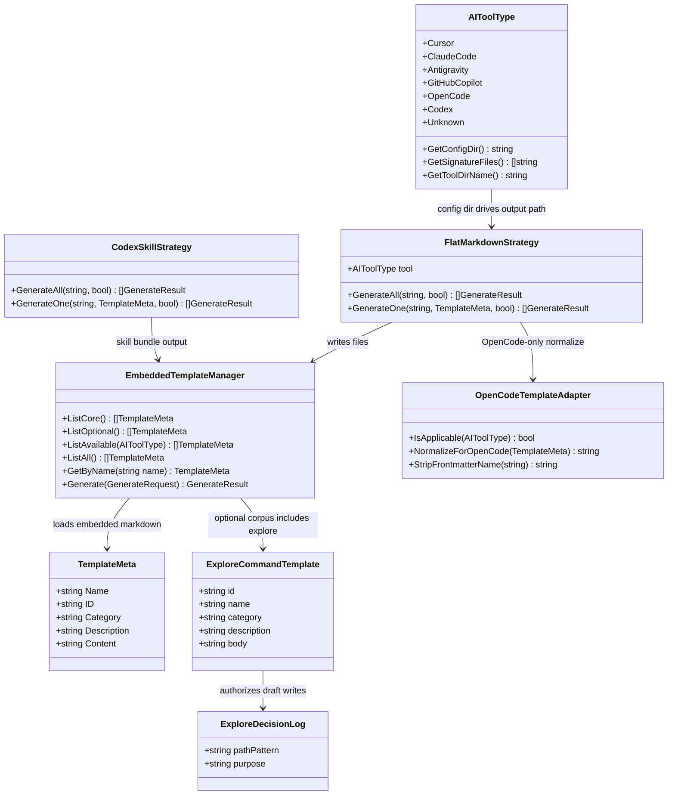

# Add SPDD Explore Mode, Antigravity Workflows Path, and Slash-Free Template Names

## Requirements
- Deliver an optional Explore Mode command that helps users clarify ambiguous problems before formal SPDD analysis, without generating product code.
- Align Antigravity template installation with the `.agents/workflows` directory convention while preserving detection via the existing Antigravity project marker.
- Standardize embedded core and optional template frontmatter so `name` values are slash-free, while keeping slash-prefixed CLI lookups working for compatibility.
- Preserve existing OpenCode name-stripping and Codex skill naming behavior after metadata standardization.

## Entities

## Approach
1. Template Corpus Extension:
   - Add `spdd-explore` as an optional embedded markdown command under `internal/templates/data/optional/`.
   - Do not place explore in `data/core/`, so `ListAvailable` and default `generate --all` remain unchanged.
   - Encode Explore Mode as prompt policy (Default Deny, Distorted Mirror, M1–M4, transition checkpoint, Decision Log), not as new Go workflow runtime.

2. Detector Path Alignment:
   - Change only `Antigravity.GetConfigDir()` to return `.agents/workflows`.
   - Keep `GetSignatureFiles()` for Antigravity as `.antigravity` so auto-detection behavior remains stable.
   - Rely on existing `filepath.Join(workingDir, GetConfigDir())` consumers (init/generate/uninstall) so Antigravity writes and cleanup target `.agents/workflows` exclusively, never the whole `.agents` tree (Codex owns `.agents/skills`).

3. Frontmatter Standardization + Lookup Compatibility:
   - Update every core and optional template frontmatter `name` from `/...` to the bare command id-style value (example: `spdd-analysis`, `spdd-explore`).
   - Keep `id` fields unchanged.
   - Teach `GetByName` to normalize the lookup key by trimming a single leading `/` before case-insensitive comparison against `Name` and `ID`, so both `spdd-analysis` and `/spdd-analysis` resolve.
   - Leave `OpenCodeTemplateAdapter` in place: OpenCode outputs must still omit the `name` key entirely.
   - Leave Codex `TrimPrefix(meta.Name, "/")` behavior in place; with slash-free source names it becomes a no-op trim and remains correct.

4. Documentation and Regression Gates:
   - Update README tables that still advertise Antigravity commands under `.antigravity/commands/` to `.agents/workflows/`.
   - Add a short migration note: regenerate Antigravity workflows after upgrade; stale files under `.antigravity/commands/` are not auto-migrated.
   - Update detector/template tests that hard-code the old Antigravity path or slash-prefixed `name` assertions.

## Structure

### Inheritance Relationships
1. `AIToolType` remains the closed enum driving config directories and signatures; only the Antigravity config-dir branch changes.
2. `TemplateManager` interface remains unchanged; `EmbeddedTemplateManager` continues to implement it.
3. `FlatMarkdownStrategy` and `CodexSkillStrategy` continue to implement the existing generation strategy contract.
4. `OpenCodeTemplateAdapter` remains a focused compatibility helper used by `FlatMarkdownStrategy` for OpenCode only.
5. No new exception types or packages are introduced.

### Dependencies
1. CLI generate/init/uninstall paths depend on `AIToolType.GetConfigDir()` for Antigravity output location.
2. `EmbeddedTemplateManager.GetByName` depends on slash-tolerant name normalization before matching `TemplateMeta.Name`/`ID`.
3. `FlatMarkdownStrategy.GenerateOne` depends on `GetConfigDir()` for target directory and on `OpenCodeTemplateAdapter` when tool is OpenCode.
4. Optional listing (`openspdd list --optional`) depends on `ListOptional()` discovering `spdd-explore.md` via embed.
5. README EN/ZH documentation depends on accurate Antigravity path rows.

### Layered Architecture
1. Detector Layer: tool identity, signatures, and config directory mapping.
2. Template Asset Layer: embedded `data/core` and `data/optional` markdown commands.
3. Template Management Layer: listing, slash-tolerant lookup, and file writes.
4. Strategy Layer: tool-specific generation (flat markdown, OpenCode normalize, Codex skills).
5. CLI/Docs Layer: user-facing install paths, optional template discovery, and migration guidance.
6. Test Layer: detector path expectations, optional explore presence, frontmatter name contracts, GetByName slash compatibility, OpenCode/Codex regressions.

## Operations

### Update Detector Mapping - `AIToolType.GetConfigDir`
1. Responsibility: map Antigravity installs to the workflows directory expected by that tool.
2. Package: `internal/detector`
3. Methods:
   - `GetConfigDir()` for `Antigravity`
     - Logic:
       - Return exactly `.agents/workflows` (no leading slash, no trailing slash).
       - Leave all other tool branches unchanged (`Cursor` → `.cursor/commands`, `ClaudeCode` → `.claude/commands`, `GitHubCopilot` → `.github/copilot-prompts`, `OpenCode` → `.opencode/commands`, `Codex` → `.agents/skills`).
   - `GetSignatureFiles()` for `Antigravity`
     - Logic:
       - Keep returning `.antigravity` only in this change set.
       - Do not add `.agents/workflows` as a detection signature in this feature (avoids false positives with Codex-only `.agents` trees).
4. Constraints:
   - Uninstall/init/generate must continue to operate only on the returned config dir, never recursively delete `.agents`.
5. Verification:
   - `TestAIToolType_GetConfigDir` Antigravity row expects `.agents/workflows`.
   - Detector tests that assert Antigravity `ConfigPath` must join working dir with `.agents/workflows`.

### Update Lookup Compatibility - `EmbeddedTemplateManager.GetByName`
1. Responsibility: keep slash-prefixed and slash-free template lookups working after source `name` standardization.
2. Package: `internal/templates`
3. Methods:
   - `GetByName(name string) (TemplateMeta, error)`
     - Logic:
       - Load all templates via existing `ListAll()`.
       - Normalize the input by lowercasing and trimming a single leading `/` character if present (example: `/spdd-analysis` → `spdd-analysis`).
       - Also prepare the raw lowercased input for comparison.
       - Match if either normalized or raw lowercased input equals lowercased `t.Name` or lowercased `t.ID`.
       - Prefer first match in existing iteration order; return `ErrTemplateNotFound` when none match.
4. Constraints:
   - Do not strip more than one leading slash.
   - Do not alter stored `TemplateMeta.Name` values at parse time; only normalize the lookup key.
5. Verification:
   - `GetByName("spdd-analysis")` and `GetByName("/spdd-analysis")` both succeed and return the same `ID`.
   - Existing case-insensitive tests continue to pass.

### Standardize Core Template Frontmatter Names
1. Responsibility: remove leading `/` from core command `name` fields.
2. Files under `internal/templates/data/core/`:
   - `spdd-analysis.md`
   - `spdd-generate.md`
   - `spdd-prompt-update.md`
   - `spdd-reasons-canvas.md`
   - `spdd-sync.md`
3. Logic for each file:
   - Change frontmatter `name: /<id>` to `name: <id>` where `<id>` equals the existing `id` value.
   - Keep `id`, `category`, and `description` unchanged.
   - Do not modify command body content in this operation except where body text is unrelated to this metadata change.
4. Constraints:
   - After change, no core template frontmatter line may match `name: /`.
5. Verification:
   - `ListCore()` returns `Name` values without leading `/`.
   - OpenCode generation still strips `name` entirely via adapter.
   - Non-OpenCode flat generation writes the updated frontmatter verbatim.

### Standardize Optional Template Frontmatter Names
1. Responsibility: remove leading `/` from optional command `name` fields.
2. Files under `internal/templates/data/optional/`:
   - `aupro-context.md`
   - `spdd-api-test.md`
   - `spdd-code-review.md`
   - `spdd-reverse.md`
   - `spdd-story.md`
3. Logic for each file:
   - Change `name: /<id>` to `name: <id>` matching existing `id`.
   - Keep remaining frontmatter and body intact.
4. Constraints:
   - Optional templates remain discoverable only through `ListOptional` / `ListAll`, not through default `ListAvailable`.
5. Verification:
   - `ListOptional()` names are slash-free.
   - Codex optional generate for `spdd-reverse` still produces skill bundle under `.agents/skills/spdd-reverse/`.

### Create Optional Template - `spdd-explore.md`
1. Responsibility: ship Explore Mode as an opt-in SPDD pre-analysis command template.
2. Path: `internal/templates/data/optional/spdd-explore.md`
3. Frontmatter:
   - `name`: `spdd-explore`
   - `id`: `spdd-explore`
   - `category`: `Development`
   - `description`: `Enters explore mode — a thinking partner for exploring ideas, investigating problems, and clarifying requirements before starting a formal analysis.`
4. Body sections (must include all of the following, in this order):
   - `Default Deny Policy` with fundamental guardrails:
     - Absolute read-only for product code: may read/browse/map codebase; must never modify/create/delete project files except Explore Decision Log drafts.
     - Zero implementable code: never write implementation code; if user requests implementation, redirect to exit explore and use `/spdd-generate` (or run `/spdd-analysis` first).
     - No rigid workflow: stance, not mandatory algorithm; do not force unnecessary files.
     - SPDD alignment: secondary objective is maturing requirements for `/spdd-analysis`.
   - `Exception Handlers (Anti-Fragility)` covering shallow/vague context pause, formal terminate on repeated read-only violations, refuse forced code generation, and refuse premature `/spdd-analysis` transition.
   - `Core (The "Why")` mindset: curious, open paths, visual (Mermaid/ASCII/trade-off tables), patient, grounded in current code.
   - `Distorted Mirror Technique`:
     - Every 3–4 interactions, reflect understanding while deliberately injecting 1–2 plausible unconfirmed assumptions.
     - Include the login/OAuth2 vs JWT example from the requirement.
     - Rules: plausible distortions, do not announce the test, reveal tacit assumptions, never use to confirm complex architectures.
   - `Micro Action Segments` executed on demand:
     - M1 Explore the Problem Space
     - M2 Investigate the Codebase
     - M3 Compare Options (max 3 approaches; Performance/Maintainability/Scalability)
     - M4 Expose Risks and Uncertainties
   - `Transition Checkpoint` requiring ALL conditions before suggesting `/spdd-analysis`:
     - `problem_defined = TRUE`
     - `direction_chosen = TRUE`
     - `uncertainties_mitigated = TRUE`
     - `codebase_mapped = TRUE`
     - `distorted_mirror_applied = TRUE`
     - `implicit_assumptions = FALSE`
     - Transition ask text: invite formalizing via `/spdd-analysis` to create the foundational strategic artifact.
   - `Decision Log`: when consensus/decision is reached, create draft markdown at `spdd/explore/{timestamp}-[Explore]-{description}.md`.
   - `Final Reminder`: do not rush discovery; explore ends when the user has enough insight to move forward.
5. Constraints:
   - File must live under `optional/`, never `core/`.
   - Decision Log is the only authorized write surface called out by the template.
6. Verification:
   - `ListOptional()` includes `spdd-explore`.
   - `ListCore()` and `ListAvailable(any tool)` do not include `spdd-explore`.
   - `GetByName("spdd-explore")` and `GetByName("/spdd-explore")` succeed.
   - Explicit generate of `spdd-explore` for Cursor writes `.cursor/commands/spdd-explore.md`; for Antigravity writes `.agents/workflows/spdd-explore.md`.

### Update Documentation - Antigravity Path and Optional Explore
1. Responsibility: keep user-facing docs aligned with detector mapping and optional explore availability.
2. Files:
   - `README.md`
   - `README.zh-CN.md`
3. Logic:
   - In the supported-tools table, change Antigravity config/commands column from `.antigravity/commands/` to `.agents/workflows/`.
   - Keep detection marker description as `.antigravity/` unless the table already distinguishes detection vs install path; if a single column mixes both, clarify detection = `.antigravity/` and install = `.agents/workflows/`.
   - Add a brief migration note near tool-support docs: after upgrading, re-run generate for Antigravity; previous files under `.antigravity/commands/` are not moved automatically.
   - Mention that `spdd-explore` is an optional template installable via optional listing/generation (wording consistent with existing optional-template docs if present; otherwise one short bullet).
4. Constraints:
   - Do not claim explore is installed by default.
5. Verification:
   - README EN/ZH no longer advertise Antigravity install path as `.antigravity/commands/`.

### Update Tests - Detector, Manager, Strategies
1. Responsibility: lock the new contracts and prevent regressions.
2. Files to update/extend:
   - `tests/detector/types_test.go`: Antigravity `GetConfigDir` expected value → `.agents/workflows`.
   - `tests/detector/detector_test.go`: Antigravity detected `ConfigPath` expectations → `.../.agents/workflows`.
   - `tests/templates/manager_test.go`: add/adjust coverage for optional `spdd-explore` presence; add slash-prefixed lookup compatibility for a core template and for `spdd-explore`.
   - `tests/templates/types_test.go`: any fixture asserting `name: /spdd-generate` updated to slash-free form if it validates live corpus parsing expectations.
   - `tests/templates/opencode_flat_strategy_test.go`:
     - Keep using slash-prefixed `GetByName` if desired (must still work).
     - Assertions that non-OpenCode output contains `name: /spdd-analysis` must change to `name: spdd-analysis`.
     - OpenCode output must still contain no `name:` frontmatter key.
   - `tests/templates/codex_strategy_test.go`: keep slash-prefixed lookups working; skill `name` remains slash-free.
3. Constraints:
   - Do not weaken OpenCode “no name key” assertions.
   - Do not assert deletion or modification of `.agents/skills` when testing Antigravity paths.
4. Verification:
   - Full relevant packages pass: `tests/detector`, `tests/templates`, and any cmd tests that embed Antigravity config paths.

## Norms
1. Embedded Template Standards:
   - Frontmatter keys remain `name`, `id`, `category`, `description`.
   - `name` must equal `id` with no leading `/` for all core and optional SPDD command templates.
   - `id` remains the filename stem and generation basename.
2. Corpus Placement:
   - Mandatory pipeline commands stay in `data/core/`.
   - Situational/pre-analysis/post-validation commands stay in `data/optional/`.
   - Explore Mode is optional by definition.
3. Detector Mapping:
   - `GetConfigDir()` returns relative directory paths without leading or trailing slashes.
   - Shared parent directories (`.agents`) may host multiple tool children; operations must target the leaf config dir only.
4. Lookup Compatibility:
   - Public template lookup accepts both slash-prefixed and slash-free names via input normalization, not by mutating stored metadata.
5. Strategy Boundaries:
   - Tool-specific output quirks stay in adapters/strategies (OpenCode strip-name, Codex skill transform).
   - Shared source templates remain the single corpus.
6. Documentation Standards:
   - EN and ZH README tool tables must stay path-accurate after detector changes.
   - Optional templates must be labeled optional in docs when newly introduced.
7. Testing Standards:
   - Path mapping changes require table-driven detector expectation updates in the same change set.
   - Frontmatter standardization requires at least one positive slash-prefixed lookup test and one OpenCode no-`name` regression test.

## Safeguards
1. Functional Constraints:
   - `spdd-explore` MUST exist under `internal/templates/data/optional/spdd-explore.md` and MUST NOT exist under `data/core/`.
   - Explore template MUST forbid implementable code generation and product-file mutation, with the sole write exception `spdd/explore/{timestamp}-[Explore]-{description}.md`.
   - Explore template MUST include Distorted Mirror Technique, M1–M4, and the six-condition transition checkpoint before suggesting `/spdd-analysis`.
2. Path Constraints:
   - `detector.Antigravity.GetConfigDir()` MUST return exactly `.agents/workflows`.
   - Antigravity generate/init/uninstall MUST NOT delete or rewrite `.agents/skills` or other non-workflows children of `.agents`.
   - Antigravity `GetSignatureFiles()` remains `.antigravity` in this change set.
3. Metadata Constraints:
   - After standardization, no file in `data/core/` or `data/optional/` may contain a frontmatter line starting with `name: /`.
   - `GetByName("/spdd-analysis")` and `GetByName("spdd-analysis")` MUST both succeed.
   - `GetByName("/spdd-explore")` and `GetByName("spdd-explore")` MUST both succeed.
4. Compatibility Constraints:
   - OpenCode generated command files MUST continue to omit the `name` frontmatter key.
   - Codex skill generation MUST continue to emit slash-free skill names and skill-bundle layout.
   - Non-Antigravity config directories MUST remain unchanged.
5. Documentation Constraints:
   - README.md and README.zh-CN.md MUST document Antigravity install path as `.agents/workflows/` (or equivalent localized wording).
   - Docs MUST NOT claim `spdd-explore` is part of default core install.
6. Scope Constraints:
   - Do not introduce a Go runtime that enforces Explore Mode transition gates.
   - Do not auto-migrate stale `.antigravity/commands` files; document regeneration instead.
   - Do not reverse GGQPA-006 by removing `OpenCodeTemplateAdapter`; keep it.
7. Quality Constraints:
   - Detector and templates test packages covering touched contracts MUST pass after the change.
   - No placeholders or incomplete explore policy sections are allowed in `spdd-explore.md`.
