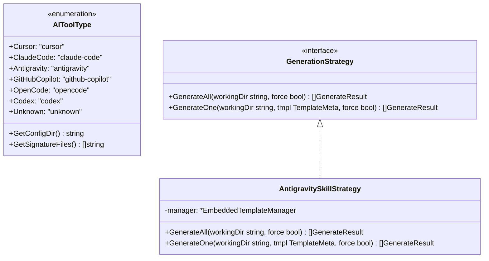

# Add Antigravity Skills Support to OpenSPDD via Dedicated Strategy

## Requirements

Extend OpenSPDD to support Google Antigravity as a first-class AI tool target whose SPDD command set is generated as project-scoped skill bundles under `<repo>/.agents/skills/<id>/SKILL.md` (the official customization path scanned by Antigravity CLI and IDE), update the environment detector to recognize Antigravity workspace signatures (`.agents`, `AGENTS.md`, `GEMINI.md`, `.antigravity`), and implement `AntigravitySkillStrategy` registered via the `GenerationStrategy` registry.

---

## Entities



---

## Approach

1. **Config Directory Alignment**: Update `Antigravity.GetConfigDir()` in `internal/detector/types.go` from `".antigravity/commands"` to `".agents/skills"`.
2. **Signature Files Enhancement**: Update `Antigravity.GetSignatureFiles()` in `internal/detector/types.go` to return `[]string{".agents", "AGENTS.md", "GEMINI.md", ".antigravity"}`.
3. **Dedicated Strategy**: Create `internal/templates/antigravity_strategy.go` implementing `GenerationStrategy`. It registers itself under `detector.Antigravity` in `init()` and outputs `.agents/skills/<id>/SKILL.md` with sanitized YAML frontmatter using the existing package helpers (`buildSkillMd`, `writeSkillFile`).
4. **Clean Skill Bundle**: Unlike Codex, Antigravity does not generate `agents/openai.yaml`. Each template produces exactly one `SKILL.md` file within its skill folder.

---

## Structure

```text
internal/
├── detector/
│   └── types.go                 # Update Antigravity GetConfigDir and GetSignatureFiles
└── templates/
    ├── antigravity_strategy.go  # NEW: AntigravitySkillStrategy implementation
    └── strategy.go              # Shared strategy registry

tests/
├── detector/
│   ├── types_test.go            # Updated test assertions for Antigravity
│   └── detector_test.go         # Added detection tests for .agents, AGENTS.md, GEMINI.md
└── templates/
    ├── antigravity_strategy_test.go # NEW: Unit tests for Antigravity skill strategy
    └── strategy_test.go         # Updated registry test assertions

README.md                        # Updated tool compatibility table & Antigravity section
README.zh-CN.md                  # Updated Chinese documentation
```

---

## Operations

1. **Modify `internal/detector/types.go`**:
   - In `GetConfigDir()`: change `case Antigravity:` to return `".agents/skills"`.
   - In `GetSignatureFiles()`: change `case Antigravity:` to return `[]string{".agents", "AGENTS.md", "GEMINI.md", ".antigravity"}`.
2. **Create `internal/templates/antigravity_strategy.go`**:
   - Implement `AntigravitySkillStrategy` struct with `manager *EmbeddedTemplateManager`.
   - Self-register in `init()` via `RegisterStrategy(detector.Antigravity, ...)`.
   - Implement `GenerateAll(workingDir string, force bool) []GenerateResult`.
   - Implement `GenerateOne(workingDir string, tmpl TemplateMeta, force bool) []GenerateResult`.
3. **Create `tests/templates/antigravity_strategy_test.go`**:
   - Test generating all core templates creates `<workingDir>/.agents/skills/<id>/SKILL.md`.
   - Test frontmatter contains `name:` and `description:` without leading `/`.
   - Test overwrite protection without `--force` and overwrite success with `--force`.
   - Test single-template generation for both core and optional templates.
4. **Update `tests/detector/types_test.go`**:
   - Update `TestAIToolType_GetConfigDir` want value for Antigravity to `".agents/skills"`.
   - Update `TestAIToolType_GetSignatureFiles` want values for Antigravity to `[]string{".agents", "AGENTS.md", "GEMINI.md", ".antigravity"}`.
5. **Update `tests/detector/detector_test.go`**:
   - Update `TestDefaultDetector_GetConfigDirPath` for Antigravity to expect `"/project/.agents/skills"`.
   - Update `TestDefaultDetector_Detect_AntigravityEnvironment` to check `.agents/skills`.
   - Add test cases for `.agents`, `AGENTS.md`, and `GEMINI.md` detection.
6. **Update `tests/templates/strategy_test.go`**:
   - Remove `detector.Antigravity` from `TestStrategyFor_FlatMarkdownToolsReturnFlatStrategy`.
   - Add `TestStrategyFor_AntigravityReturnsAntigravityStrategy`.
   - Add `detector.Antigravity` to `TestStrategyRegistry_ContainsExpectedTools`.
7. **Update Documentation**:
   - Update `README.md` and `README.zh-CN.md` tool tables and add Antigravity skill usage guidance.

---

## Norms

- Maintain 100% test coverage for detector and template generation paths.
- Follow Go conventions (`go fmt` compliance, zero linter warnings).
- Do not modify or leak state outside `workingDir`.
- Preserve existing behavior for all other tools (`Cursor`, `ClaudeCode`, `GitHubCopilot`, `OpenCode`, `Codex`).

---

## Safeguards

- Antigravity detection MUST NOT conflict with Codex or Cursor detection.
- `AntigravitySkillStrategy` MUST NOT create `agents/openai.yaml` files.
- Single-template generation MUST NOT produce flat markdown files (`.agents/skills/<name>.md`).
- Overwriting existing skills without `--force` MUST fail safely with `internal.ErrFileExists`.
